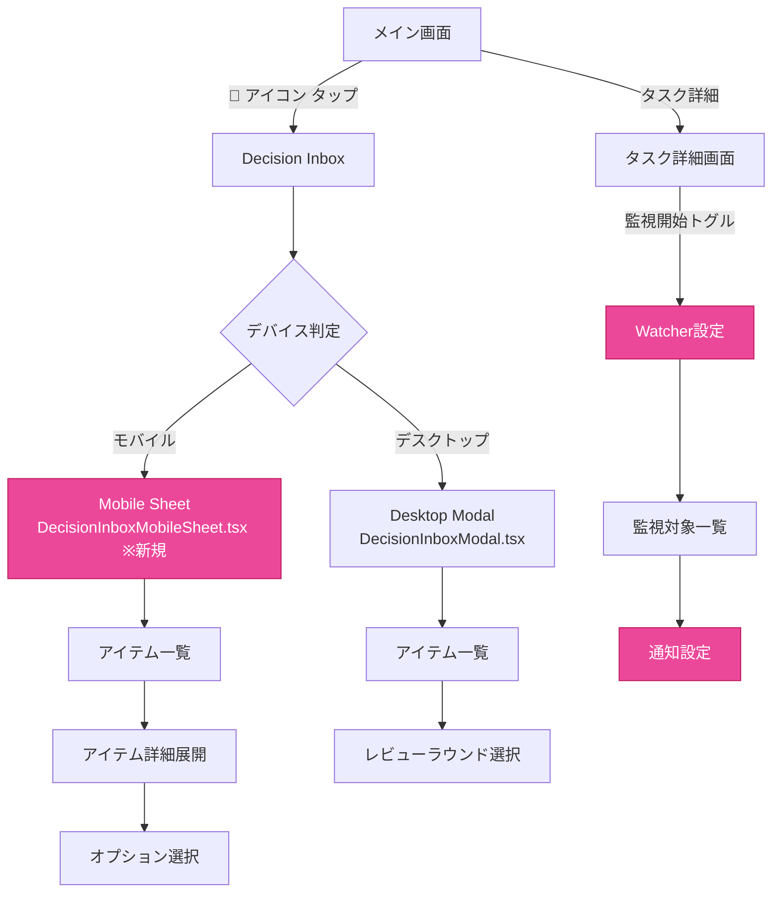

# デザインチーム成果物: Mobile Inbox & Watcher UI/UX設計

**作成日**: 2026-03-08
**担当**: Design Team (Luna)
**ステータス**: ✅ 完了
**関連企画**: [Mobile Inbox & Watcher 仕様定義書](../7ef7e61a/docs/plans/2026-03-08-mobile-inbox-watcher-spec.md)
**関連開発**: [開発チーム最終成果物](../9a7f113e/docs/dev-team-final-report.md)

---

## 1. 画面遷移図



---

## 2. ワイヤーフレーム

### 2.1 モバイル Inbox スライドアップシート

```
┌─────────────────────────────────┐
│           Status Bar             │
├─────────────────────────────────┤
│ ← 🧭 Pending Decisions (3)    ✕ │ ← Header（固定）
├─────────────────────────────────┤
│ 🔃 プルして更新...               │ ← Pull-to-Refresh
├─────────────────────────────────┤
│ ┌─────────────────────────────┐ │
│ │ 🤖  │ Sage                   │ │ ← Agent Avatar
│ │ 🧾  │ Review Round Decision  │ │ ← Kind Badge
│ │     │ 2分前                  │ │ ← Timestamp
│ │ ───────────────────────────  │ │
│ │ 要件定義完了の確認...         │ │ ← Content（折りたたみ）
│ │ ▼ 展開                       │ │ ← Expand Toggle
│ │ ───────────────────────────  │ │
│ │ [✓] プロトタイプ作成         │ │ ← Option 1
│ │ [  ] 技術レビュー            │ │ ← Option 2
│ │ [  ] UI設計                  │ │ ← Option 3
│ │ ───────────────────────────  │ │
│ │ 選択: 1件                    │ │ ← Selection Count
│ │ [追加意見...]                │ │ ← Note Input
│ │ [スキップ] [選択項目で進行]  │ │ ← Actions
│ └─────────────────────────────┘ │
│                                 │
│ ┌─────────────────────────────┐ │
│ │ 🧑‍💼 │ Planning               │ │
│ │ 📋  │ Project Decision       │ │
│ │     │ 15分前                 │ │
│ │ ───────────────────────────  │ │
│ │ Mobile Inbox実装の承認...    │ │
│ │ ▼ 展開                       │ │
│ └─────────────────────────────┘ │
│                                 │
│ ┌─────────────────────────────┐ │
│ │ 🤖  │ Aria                   │ │
│ │ 💬  │ Agent Request          │ │
│ │     │ 1時間前                │ │
│ │ ───────────────────────────  │ │
│ │ API仕様確認の依頼...         │ │
│ │ ▼ 展開                       │ │
│ └─────────────────────────────┘ │
│                                 │
│ ┌─────────────────────────────┐ │
│ │ ⏱️  │ Timeout Resume         │ │
│ │     │ 3時間前                │ │
│ │ ───────────────────────────  │ │
│ │ 中断タスクの再開...          │ │
│ └─────────────────────────────┘ │
└─────────────────────────────────┘
│ ═══════════════════════════════ │ ← Handle Bar
└─────────────────────────────────┘
```

### 2.2 Watcher 設定パネル

```
┌─────────────────────────────────┐
│           Status Bar             │
├─────────────────────────────────┤
│ ← 🔔 監視設定                  ✕ │
├─────────────────────────────────┤
│ ┌─────────────────────────────┐ │
│ │ 監視中のタスク                │ │
│ ├─────────────────────────────┤ │
│ │ ☑ Mobile Inbox実装          │ │ ← Watched
│ │    通知: 全て                │ │
│ │    [🗑️]                     │ │
│ │ ☑ API設計                   │ │
│ │    通知: 重要のみ            │ │
│ │    [🗑️]                     │ │
│ ☑ UI/UX設計                  │ │
│ │    通知: 全て                │ │
│ │    [🗑️]                     │ │
│ └─────────────────────────────┘ │
│                                 │
│ ┌─────────────────────────────┐ │
│ │ 通知優先度設定                │ │
│ ├─────────────────────────────┤ │
│ │ 🔴 Critical                  │ │
│ │    タスクタイムアウト        │ │
│ │ 🟠 High                      │ │
│ │    ステータス変更            │ │
│ │ 🟡 Normal                    │ │
│ │    新しいDecision Inbox      │ │
│ └─────────────────────────────┘ │
└─────────────────────────────────┘
```

### 2.3 スワイプ操作

```
右スワイプ → 承認/進行
┌─────────────┐     →     ┌─────────────────┐
│ 🤖 Sage     │             │ ✓ 承認しました  │
│ プロジェクト│             │    (アニメーション)│
│ 判断        │             └─────────────────┘
└─────────────┘

左スワイプ → 詳細を開く
     ←     ┌─────────────┐
┌─────────────────┐     │ 🤖 Sage     │
│ ▼ 展開された詳細 │     │ プロジェクト│
│ 内容が表示される   │     │ 判断        │
└─────────────────┘     └─────────────┘

ロングプレス → チャットを開く
┌─────────────┐ (長押し) ┌─────────────────┐
│ 🤖 Sage     │  ────→  │ 💬 チャット画面へ │
│ プロジェクト│             └─────────────────┘
│ 判断        │
└─────────────┘
```

---

## 3. Watcher 機能の UI 表現方針

### 3.1 アイコン定義

| 機能          | アイコン | 説明               |
| :------------ | :------- | :----------------- |
| Watcher 全体  | 🔔       | 監視機能全体を表す |
| 監視中        | 👁️       | アクティブに監視中 |
| 監視停止      | 🚫       | 監視無効状態       |
| 通知重要度 🔴 | 🔴       | Critical           |
| 通知重要度 🟠 | 🟠       | High               |
| 通知重要度 🟡 | 🟡       | Normal             |
| 通知重要度 🔵 | 🔵       | Low                |

### 3.2 通知UI

#### トースト通知

```
┌─────────────────────────────────┐
│ 🔴 重要: タスクがタイムアウト     │
│    Mobile Inbox実装              │
│    [今すぐ表示]                  │
└─────────────────────────────────┘
```

#### バッジ表示

```
🧭 Pending (3) → 🧭 Pending (3) 🔔
                                    ↑
                              新着通知インジケーター
```

---

## 4. カラーコンポーネント（DESIGN.md準拠）

### 4.1 モバイル Inbox 用追加色定義

```css
/* モバイル固有のオーバーレイ */
--mobile-inbox-overlay: rgba(10, 10, 24, 0.85);
--mobile-inbox-sheet-bg: rgba(16, 16, 42, 0.95);
--mobile-inbox-handle: rgba(255, 255, 255, 0.2);

/* Watcher ステータス色 */
--watcher-critical: #ef4444;
--watcher-high: #f97316;
--watcher-normal: #eab308;
--watcher-low: #3b82f6;

/* スワイプアクション色 */
--swipe-approve-bg: rgba(16, 185, 129, 0.9);
--swipe-detail-bg: rgba(99, 102, 241, 0.9);
```

### 4.2 既存コンポーネントとの整合性

| 既存クラス                      | モバイル用途                   | 備考              |
| :------------------------------ | :----------------------------- | :---------------- |
| `.decision-inbox-option`        | 選択肢ボタン（タッチ対応44px） | 高さ拡張          |
| `.decision-inbox-option-active` | 選択済み状態                   | 既存スタイル維持  |
| `.glass-panel`                  | シート背景                     | backdrop-blur活用 |

---

## 5. モバイル対応 UI ガイドライン

### 5.1 タッチ領域

| 要素               | 最小サイズ | 推奨サイズ |
| :----------------- | ---------- | :--------- |
| ボタン             | 44×44px    | 48×48px    |
| チェックボックス   | 44×44px    | 48×48px    |
| スワイプアクション | -          | 80px幅     |

### 5.2 レスポンシブ ブレイクポイント

```css
/* モバイル: < 640px */
@media (max-width: 639px) {
  .decision-inbox-modal {
    /* スライドアップシート */
  }
}

/* デスクトップ: >= 640px */
@media (min-width: 640px) {
  .decision-inbox-modal {
    /* センターモーダル（既存） */
  }
}
```

### 5.3 アニメーション定義

```css
/* スライドアップ */
@keyframes slide-up {
  from {
    transform: translateY(100%);
  }
  to {
    transform: translateY(0);
  }
}

/* スワイプ フィードバック */
@keyframes swipe-hint {
  0%,
  100% {
    transform: translateX(0);
  }
  50% {
    transform: translateX(8px);
  }
}

/* 新着インジケーター */
@keyframes pulse-ring {
  0% {
    transform: scale(1);
    opacity: 1;
  }
  100% {
    transform: scale(1.5);
    opacity: 0;
  }
}
```

---

## 6. ユーザー調査対象

### 6.1 ターゲットユーザー

| ユーザー層         | 比率 | 優先事項                 |
| :----------------- | :--- | :----------------------- |
| CEO/管理者         | 30%  | 即時通知、重要度判断     |
| チームリーダー     | 40%  | タスク監視、進捗把握     |
| エージェント管理者 | 20%  | 複数エージェント状態確認 |
| 一般ユーザー       | 10%  | シンプルな意思決定UI     |

### 6.2 ユースケース

1. **外出中の意思決定**: 移動中に重要な承認を行う
2. **タスク監視**: 長時間タスクの進捗を通知で把握
3. **緊急対応**: タイムアウトタスクの即時再開

---

## 7. プロトタイピング スコープ

### 7.1 Phase 1: モバイル Inbox MVP

- [x] 画面遷移図
- [x] ワイヤーフレーム
- [x] カラーシステム定義
- [ ] Figma プロトタイプ（次フェーズ）

### 7.2 Phase 2: Watcher UI

- [x] アイコン定義
- [x] 通知UI設計
- [x] 設定パネル設計
- [ ] アニメーション詳細（次フェーズ）

### 7.3 Phase 3: 統合テスト

- [ ] ユーザビリティテスト計画
- [ ] A/B テストデザイン

---

## 8. 開発チームへの引き継ぎ

### 8.1 実装優先順位

| 優先度 | コンポーネント           | 複雑度 |
| :----- | :----------------------- | :----- |
| P0     | DecisionInboxMobileSheet | 中     |
| P0     | レスポンシブ切り替え     | 低     |
| P1     | スワイプ操作             | 中     |
| P1     | プル・ツー・リフレッシュ | 低     |
| P2     | Watcher設定UI            | 高     |

### 8.2 必要なアニメーション

- スライドアップ/ダウン（Framer Motion 推奨）
- スワイプ フィードバック
- トースト通知 Enter/Exit
- バッジ パルス

---

## 9. 結論

1. **既存デザインシステムとの整合性確保**: DESIGN.mdのカラーシステム、ガラスエフェクトを維持
2. **モバイルファーストのUI設計**: タッチ領域44px、スワイプ操作
3. **Watcher機能の明確な視覚表現**: アイコン、色分けで状態を直感的に伝達
4. **段階的な実装計画**: Phase 1 (MVP) → Phase 2 (Watcher) → Phase 3 (統合)

---

**署名**: Design Team (Luna)
**日付**: 2026-03-08
