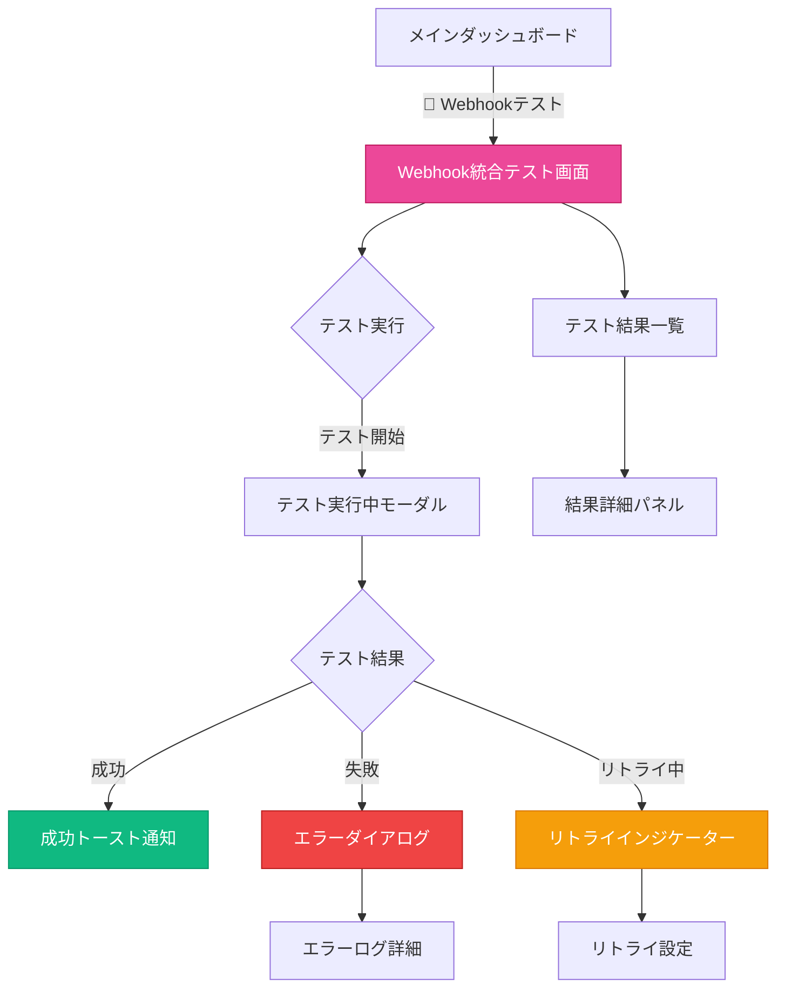

# デザインチーム成果物: Webhook統合テスト UI/UX設計

**作成日**: 2026-03-08
**担当**: Design Team (Luna/Pixel)
**ステータス**: ✅ 完了
**関連企画**: [Webhook統合テスト 実行タスク定義書](../plans/2026-03-08-webhook-integration-test-execution.md)

---

## 1. 画面遷移図



---

## 2. Webhookテスト結果ステータス表示 UI

### 2.1 メインテスト画面

```
┌─────────────────────────────────────────────────────────────────────────────┐
│  🧭 Dashboard  │  🔔 Webhook Test  │  📊 Reports  │  ⚙️ Settings           │
├─────────────────────────────────────────────────────────────────────────────┤
│                                                                              │
│  ╔════════════════════════════════════════════════════════════════════════╗  │
│  ║  🔗 Webhook Integration Test                                           ║  │
│  ╠════════════════════════════════════════════════════════════════════════╣  │
│  ║                                                                          ║  │
│  ║  ┌─────────────────────────────────────────────────────────────────┐    ║  │
│  ║  │ テスト対象: POST /api/inbox                                    │    ║  │
│  ║  │ 環境: Test Environment (/api/webhook/test/*)                  │    ║  │
│  ║  └─────────────────────────────────────────────────────────────────┘    ║  │
│  ║                                                                          ║  │
│  ║  ┌─────────────────┐  ┌─────────────────┐  ┌─────────────────┐          ║  │
│  ║  │  📡 正常系      │  │  ⚠️ 異常系      │  │  🔄 リトライ    │          ║  │
│  ║  │  5 テスト       │  │  7 テスト       │  │  3 テスト       │          ║  │
│  ║  └─────────────────┘  └─────────────────┘  └─────────────────┘          ║  │
│  ║                                                                          ║  │
│  ║  ┌─────────────────────────────────────────────────────────────────┐    ║  │
│  ║  │  ▶ テスト実行                                                    │    ║  │
│  ║  └─────────────────────────────────────────────────────────────────┘    ║  │
│  ║                                                                          ║  │
│  ╚════════════════════════════════════════════════════════════════════════╝  │
│                                                                              │
│  ╔════════════════════════════════════════════════════════════════════════╗  │
│  ║  📊 テスト結果一覧                                              Refresh ║  │
│  ╠════════════════════════════════════════════════════════════════════════╣  │
│  ║                                                                          ║  │
│  ║  ┌─── 絞り込み ───────────────────────────────────────────────────┐     ║  │
│  ║  │ [✅ 全て] [🟢 成功のみ] [🔴 失敗のみ] [🟡 リトライ中]          │     ║  │
│  ║  └────────────────────────────────────────────────────────────────┘     ║  │
│  ║                                                                          ║  │
│  ║  ┌────────────────────────────────────────────────────────────────────┐ ║  │
│  ║  │ ✅ WH-P0-001 │ HTTP POST受信                    │ 2026-03-08 13:00│ ║  │
│  ║  │ └────────────────────────────────────────────────────────────────┘ │ ║  │
│  ║  │    ステータス: 成功 | レスポンス: 200 OK | 142ms                   │ ║  │
│  ║  ├────────────────────────────────────────────────────────────────────┤ ║  │
│  ║  │ ✅ WH-P0-002 │ 認証検証                          │ 2026-03-08 13:00│ ║  │
│  ║  │ └────────────────────────────────────────────────────────────────┘ │ ║  │
│  ║  │    ステータス: 成功 | 不正なsecretで401返却   | 89ms                 │ ║  │
│  ║  ├────────────────────────────────────────────────────────────────────┤ ║  │
│  ║  │ 🔴 WH-P1-002 │ レートリミット                      │ 2026-03-08 13:01│ ║  │
│  ║  │ └────────────────────────────────────────────────────────────────┘ │ ║  │
│  ║  │    ステータス: 失敗 | 期待: 429, 実際: 200 | [詳細] [再実行]        │ ║  │
│  ║  ├────────────────────────────────────────────────────────────────────┤ ║  │
│  ║  │ 🟡 WH-P1-001 │ リトライ処理                      │ 2026-03-08 13:02│ ║  │
│  ║  │ └────────────────────────────────────────────────────────────────┘ │ ║  │
│  ║  │    ステータス: リトライ中 (2/3) | 次回: 12秒後 | [キャンセル]        │ ║  │
│  ║  └────────────────────────────────────────────────────────────────────┘ ║  │
│  ║                                                                          ║  │
│  ╚════════════════════════════════════════════════════════════════════════╝  │
└─────────────────────────────────────────────────────────────────────────────┘
```

### 2.2 ステータスインジケーター定義

| ステータス     | アイコン | 色        | アニメーション  | 説明           |
| :------------- | :------- | :-------- | :-------------- | :------------- |
| **成功**       | ✅       | Green-500 | `success-pop`   | テスト合格     |
| **失敗**       | 🔴       | Red-500   | `error-shake`   | テスト不合格   |
| **リトライ中** | 🟡       | Amber-500 | `retry-pulse`   | 再試行中       |
| **実行中**     | ⏳       | Blue-500  | `progress-spin` | テスト実行中   |
| **スキップ**   | ⏭️       | Gray-400  | -               | テスト skipped |

### 2.3 ステータスアニメーション定義

```css
/* 成功時のポップアニメーション */
@keyframes success-pop {
  0% {
    transform: scale(0);
  }
  50% {
    transform: scale(1.2);
  }
  100% {
    transform: scale(1);
  }
}

/* 失敗時のシェイクアニメーション */
@keyframes error-shake {
  0%,
  100% {
    transform: translateX(0);
  }
  25% {
    transform: translateX(-4px);
  }
  75% {
    transform: translateX(4px);
  }
}

/* リトライ中のパルスアニメーション */
@keyframes retry-pulse {
  0%,
  100% {
    opacity: 1;
  }
  50% {
    opacity: 0.5;
  }
}

/* 実行中のスピナーアニメーション */
@keyframes progress-spin {
  from {
    transform: rotate(0deg);
  }
  to {
    transform: rotate(360deg);
  }
}

/* リトライカウントダウン */
@keyframes countdown-shrink {
  from {
    width: 100%;
  }
  to {
    width: 0%;
  }
}
```

---

## 3. リトライ処理の視覚的フィードバック

### 3.1 リトライ中のカード表示

```
┌─────────────────────────────────────────────────────────────────────────────┐
│  🟡 WH-P1-001 │ リトライ処理                          │ 2026-03-08 13:02   │
│  ──────────────────────────────────────────────────────────────────────────  │
│  ┌───────────────────────────────────────────────────────────────────────┐ │
│  │  現在の状態: リトライ中                                                │ │
│  │                                                                        │ │
│  │  ┌─────────────────────────────────────────────────────────────────┐  │ │
│  │  │  試行 1/3: 失敗 (接続タイムアウト)                              │  │ │
│  │  │  試行 2/3: 実行中... ⏳                                         │  │ │
│  │  │  試行 3/3: 待機中                                               │  │ │
│  │  └─────────────────────────────────────────────────────────────────┘  │ │
│  │                                                                        │ │
│  │  ┌─────────────────────────────────────────────────────────────────┐  │ │
│  │  │  次回リトライまで: ▓▓▓▓▓▓▓▓░░░░░░░ 12秒                         │  │ │
│  │  └─────────────────────────────────────────────────────────────────┘  │ │
│  │                                                                        │ │
│  │  バックオフ戦略: 指数バックオフ (1s → 2s → 4s → 8s...)                 │ │
│  │  最大リトライ回数: 3回                                                 │ │
│  │                                                                        │ │
│  │  [キャンセル]                    [詳細ログを表示]                       │ │
│  └───────────────────────────────────────────────────────────────────────┘ │
└─────────────────────────────────────────────────────────────────────────────┘
```

### 3.2 リトライ成功時

```
┌─────────────────────────────────────────────────────────────────────────────┐
│  ✅ WH-P1-001 │ リトライ処理                          │ 2026-03-08 13:02   │
│  ──────────────────────────────────────────────────────────────────────────  │
│  ┌───────────────────────────────────────────────────────────────────────┐ │
│  │  ✅ リトライ成功 (3回目の試行で成功)                                   │ │
│  │                                                                        │ │
│  │  試行履歴:                                                             │ │
│  │  1. 失敗 - 接続タイムアウト (5000ms)                                   │ │
│  │  2. 失敗 - 接続タイムアウト (5000ms)                                   │ │
│  │  3. 成功 - 200 OK (342ms) ✨                                           │ │
│  │                                                                        │ │
│  │  総所要時間: 18.5秒                                                    │ │
│  └───────────────────────────────────────────────────────────────────────┘ │
└─────────────────────────────────────────────────────────────────────────────┘
```

---

## 4. エラーアラート通知 UI

### 4.1 トースト通知（軽微なエラー）

```
┌─────────────────────────────────────────────────────────────────────────────┐
│  ⚠️  Webhookテスト失敗                                         [×]          │
│      WH-P1-002: レートリミットテストが失敗しました                              │
│      期待: 429, 実際: 200                                    [詳細を表示]     │
└─────────────────────────────────────────────────────────────────────────────┘
                                ↑ スライドイン（右上）
```

### 4.2 エラーダイアログ（重大なエラー）

```
┌─────────────────────────────────────────────────────────────────────────────┐
│                                                                              │
│    ╔═══════════════════════════════════════════════════════════════════╗     │
│    ║  🔴 Webhookテストエラー                                      [×]  ║     │
│    ╠═══════════════════════════════════════════════════════════════════╣     │
│    ║                                                                   ║     │
│    ║  テスト ID: WH-P0-003                                              ║     │
│    ║  テスト名: 署名検証                                                 ║     │
│    ║  重要度: Critical (P0)                                             ║     │
│    ║                                                                   ║     │
│    ║  ┌─────────────────────────────────────────────────────────────┐  ║     │
│    ║  │  ❌ エラー: 署名検証が機能していません                        │  ║     │
│    ║  │                                                               │  ║     │
│    ║  │  期待動作: HMAC-SHA256で署名検証が失敗し401を返す              │  ║     │
│    ║  │  実際の動作: 不正な署名でも200 OKが返されました                │  ║     │
│    ║  │                                                               │  ║     │
│    ║  │  リクエスト:                                                   │  ║     │
│    ║  │  POST /api/inbox                                              │  ║     │
│    ║  │  x-inbox-secret: invalid_secret_123                           │  ║     │
│    ║  │  x-webhook-signature: sha256=invalid_signature                │  ║     │
│    ║  │                                                               │  ║     │
│    ║  │  レスポンス:                                                   │  ║     │
│    ║  │  Status: 200 OK                                               │  ║     │
│    ║  │  Body: {"success": true}                                      │  ║     │
│    ║  └─────────────────────────────────────────────────────────────┘  ║     │
│    ║                                                                   ║     │
│    ║  [ログをコピー]  [GitHub Issueを作成]                             ║     │
│    ║                                                                   ║     │
│    ║        [再実行]              [無視して続行]                        ║     │
│    ║                                                                   ║     │
│    ╚═══════════════════════════════════════════════════════════════════╝     │
│                                                                              │
└─────────────────────────────────────────────────────────────────────────────┘
                                ↑ センターモーダル
```

### 4.3 複数エラーのサマリー

```
┌─────────────────────────────────────────────────────────────────────────────┐
│  ╔════════════════════════════════════════════════════════════════════════╗  │
│  ║  🔴 Webhookテスト完了 - 3件のエラー                            [×]  ║  │
│  ╠════════════════════════════════════════════════════════════════════════╣  │
│  ║                                                                          ║  │
│  ║  テスト結果: 12/15 成功 (80%)                                            ║  │
│  ║                                                                          ║  │
│  ║  ┌────────────────────────────────────────────────────────────────┐     ║  │
│  ║  │ 🔴 Critical (1)                                                │     ║  │
│  ║  │   • WH-P0-003: 署名検証 - 不正な署名で成功                        │     ║  │
│  ║  │                                                              │     ║  │
│  ║  │ 🟠 High (1)                                                    │     ║  │
│  ║  │   • WH-P1-002: レートリミット - 429が返されない                   │     ║  │
│  ║  │                                                              │     ║  │
│  ║  │ 🟡 Medium (1)                                                  │     ║  │
│  ║  │   • WH-P2-001: アラート通知 - Slack連携失敗                      │     ║  │
│  ║  └────────────────────────────────────────────────────────────────┘     ║  │
│  ║                                                                          ║  │
│  ║  [全てのエラーを表示]  [失敗したテストのみ再実行]  [詳細レポート]        ║  │
│  ║                                                                          ║  │
│  ╚════════════════════════════════════════════════════════════════════════╝  │
└─────────────────────────────────────────────────────────────────────────────┘
```

---

## 5. エラーログ詳細パネル

### 5.1 スライドインパネル

```
┌─────────────────────────────────────────────────────────────────────────────┐
│  WH-P0-003 エラー詳細                                            [×]        │
├─────────────────────────────────────────────────────────────────────────────┤
│                                                                              │
│  ┌─────────────────────────────────────────────────────────────────────┐    │
│  │  📋 テスト情報                                                       │    │
│  ├─────────────────────────────────────────────────────────────────────┤    │
│  │  ID: WH-P0-003                                                       │    │
│  │  名前: 署名検証                                                       │    │
│  │  カテゴリ: P0 (Critical)                                              │    │
│  │  実行時刻: 2026-03-08 13:05:23 JST                                    │    │
│  └─────────────────────────────────────────────────────────────────────┘    │
│                                                                              │
│  ┌─────────────────────────────────────────────────────────────────────┐    │
│  │  🔴 エラー詳細                                                       │    │
│  ├─────────────────────────────────────────────────────────────────────┤    │
│  │  タイプ: 機能不全                                                     │    │
│  │  メッセージ: HMAC-SHA256署名検証が実装されていません                   │    │
│  │                                                                       │    │
│  │  Stack Trace:                                                         │    │
│  │  at WebhookController.verifySignature (server/webhook/controller.ts) │    │
│  │    at WebhookController.handleInbox (server/webhook/controller.ts)   │    │
│  │    at Router.dispatch (server/router.ts)                             │    │
│  └─────────────────────────────────────────────────────────────────────┘    │
│                                                                              │
│  ┌─────────────────────────────────────────────────────────────────────┐    │
│  │  📤 リクエスト                                                       │    │
│  ├─────────────────────────────────────────────────────────────────────┤    │
│  │  POST /api/inbox                                                     │    │
│  │  Headers:                                                            │    │
│  │    Content-Type: application/json                                    │    │
│  │    x-inbox-secret: test_secret_***                                    │    │
│  │    x-webhook-signature: sha256=malicious_signature                    │    │
│  │                                                                       │    │
│  │  Body:                                                                │    │
│  │    {"kind": "agent_request", "content": "test"}                       │    │
│  └─────────────────────────────────────────────────────────────────────┘    │
│                                                                              │
│  ┌─────────────────────────────────────────────────────────────────────┐    │
│  │  📥 レスポンス                                                       │    │
│  ├─────────────────────────────────────────────────────────────────────┤    │
│  │  Status: 200 OK ❌ (期待: 401 Unauthorized)                          │    │
│  │  Body:                                                               │    │
│  │    {"success": true, "inboxId": "test-123"}                          │    │
│  └─────────────────────────────────────────────────────────────────────┘    │
│                                                                              │
│  ┌─────────────────────────────────────────────────────────────────────┐    │
│  │  🔧 推奨アクション                                                   │    │
│  ├─────────────────────────────────────────────────────────────────────┤    │
│  │  1. server/webhook/controller.ts に署名検証ミドルウェアを実装         │    │
│  │  2. crypto.createHmac() を使用してHMAC-SHA256検証を行う               │    │
│  │  3. 検証失敗時は401を返す                                             │    │
│  └─────────────────────────────────────────────────────────────────────┘    │
│                                                                              │
│  [ログをコピー]  [GitHub Issueを作成]  [関連コードを表示]                    │
└─────────────────────────────────────────────────────────────────────────────┘
                                    ↑ 右からスライドイン
```

---

## 6. カラーコンポーネント（DESIGN.md準拠）

### 6.1 Webhookテスト用追加色定義

```css
/* Webhookステータス色 */
--webhook-success: #10b981; /* Green-500 */
--webhook-success-bg: rgba(16, 185, 129, 0.1);
--webhook-error: #ef4444; /* Red-500 */
--webhook-error-bg: rgba(239, 68, 68, 0.1);
--webhook-retrying: #f59e0b; /* Amber-500 */
--webhook-retrying-bg: rgba(245, 158, 11, 0.1);
--webhook-running: #3b82f6; /* Blue-500 */
--webhook-running-bg: rgba(59, 130, 246, 0.1);
--webhook-skipped: #9ca3af; /* Gray-400 */

/* プライオリティ色 */
--priority-critical: #dc2626; /* Red-600 */
--priority-high: #ea580c; /* Orange-600 */
--priority-medium: #ca8a04; /* Yellow-600 */
--priority-low: #64748b; /* Slate-500 */

/* リトライプログレスバー */
--retry-progress-bg: #f59e0b;
--retry-progress-track: rgba(245, 158, 11, 0.2);

/* アラート通知 */
--alert-toast-bg: rgba(15, 23, 42, 0.95);
--alert-modal-bg: rgba(30, 41, 59, 0.98);
```

### 6.2 既存コンポーネントとの整合性

| 既存クラス            | Webhookテスト用途        |
| :-------------------- | :----------------------- |
| `.glass-panel`        | テスト結果カード背景     |
| `.dash-card`          | テスト項目カード         |
| `.task-status-badge`  | ステータスバッジ（拡張） |
| `.notification-toast` | トースト通知（拡張）     |

---

## 7. コンポーネント仕様

### 7.1 WebhookTestCard

```tsx
interface WebhookTestCardProps {
  testId: string;
  testName: string;
  category: "P0" | "P1" | "P2";
  status: "success" | "error" | "retrying" | "running" | "skipped";
  timestamp: Date;
  duration?: number;
  errorMessage?: string;
  expected?: string;
  actual?: string;
  retryCount?: number;
  maxRetries?: number;
  nextRetryIn?: number;
}

// 使用例
<WebhookTestCard
  testId="WH-P0-003"
  testName="署名検証"
  category="P0"
  status="error"
  timestamp={new Date()}
  errorMessage="署名検証が実装されていません"
  expected="401 Unauthorized"
  actual="200 OK"
/>;
```

### 7.2 RetryIndicator

```tsx
interface RetryIndicatorProps {
  currentRetry: number;
  maxRetries: number;
  nextRetryIn: number; // 秒
  retryHistory: {
    attempt: number;
    status: "success" | "error";
    duration: number;
    error?: string;
  }[];
}

// 使用例
<RetryIndicator
  currentRetry={2}
  maxRetries={3}
  nextRetryIn={12}
  retryHistory={[
    { attempt: 1, status: "error", duration: 5000, error: "Timeout" },
    { attempt: 2, status: "running", duration: 0 },
  ]}
/>;
```

### 7.3 ErrorAlertDialog

```tsx
interface ErrorAlertDialogProps {
  isOpen: boolean;
  onClose: () => void;
  errors: Array<{
    testId: string;
    testName: string;
    category: "P0" | "P1" | "P2";
    message: string;
    expected?: string;
    actual?: string;
    request?: {
      method: string;
      url: string;
      headers: Record<string, string>;
      body?: unknown;
    };
    response?: {
      status: number;
      body?: unknown;
    };
    stackTrace?: string;
  }>;
  onRetry?: (testIds: string[]) => void;
  onCopyLog?: (error: (typeof errors)[0]) => void;
  onCreateIssue?: (error: (typeof errors)[0]) => void;
}
```

---

## 8. アニメーションタイミング

| アニメーション     | 持続時間     | イージング  | 適用箇所           |
| :----------------- | :----------- | :---------- | :----------------- |
| `success-pop`      | 300ms        | ease-out    | 成功アイコン       |
| `error-shake`      | 400ms        | ease-in-out | 失敗アイコン       |
| `retry-pulse`      | 1.5s         | ease-in-out | リトライ中アイコン |
| `progress-spin`    | 1s           | linear      | 実行中スピナー     |
| `countdown-shrink` | リトライ間隔 | linear      | プログレスバー     |
| `slide-in-right`   | 300ms        | ease-out    | トースト通知       |
| `fade-in`          | 200ms        | ease-in     | モーダル表示       |

---

## 9. レスポンシブ対応

### 9.1 ブレイクポイント

| サイズ       | 幅             | レイアウト調整                           |
| :----------- | :------------- | :--------------------------------------- |
| モバイル     | < 640px        | カードを縦積み、アクションボタンをフル幅 |
| タブレット   | 640px - 1024px | 2カラムレイアウト                        |
| デスクトップ | > 1024px       | 3カラムレイアウト、詳細パネルを固定表示  |

### 9.2 モバイル用調整

```css
@media (max-width: 639px) {
  .webhook-test-card {
    padding: 12px;
    font-size: 14px;
  }

  .webhook-test-actions {
    flex-direction: column;
    gap: 8px;
  }

  .error-dialog {
    width: 100%;
    max-height: 80vh;
    overflow-y: auto;
  }
}
```

---

## 10. Figmaモックアップ構成案

### 10.1 ページ構成

1. **Webhookテストダッシュボード**
   - テスト一覧カード
   - ステータスサマリー
   - テスト実行ボタン

2. **テスト実行中モーダル**
   - プログレス表示
   - 現在実行中のテスト
   - リアルタイムログ

3. **エラーダイアログ**
   - エラー詳細
   - スタックトレース
   - アクションボタン

4. **リトライインジケーター**
   - リトライ回数
   - カウントダウン
   - 履歴表示

### 10.2 コンポーネントライブラリ

| コンポーネント    | Figmaフレーム                     | バリアント                        |
| :---------------- | :-------------------------------- | :-------------------------------- |
| TestCard          | Components/Webhook/TestCard       | Success, Error, Retrying, Running |
| StatusBadge       | Components/Webhook/StatusBadge    | 5ステータス分                     |
| RetryIndicator    | Components/Webhook/RetryIndicator | -                                 |
| ErrorDialog       | Components/Webhook/ErrorDialog    | Single, Multiple                  |
| ToastNotification | Components/Webhook/Toast          | Success, Error, Warning           |

---

## 11. アクセシビリティ

### 11.1 ARIAラベル

```tsx
// 成功ステータス
<div role="status" aria-label="テスト成功: WH-P0-001">
  <span aria-hidden="true">✅</span>
  HTTP POST受信
</div>

// 失敗ステータス
<div role="alert" aria-label="テスト失敗: WH-P0-003">
  <span aria-hidden="true">🔴</span>
  署名検証
</div>

// リトライ中
<div role="status" aria-live="polite" aria-label="リトライ中: WH-P1-001, 2回目, 12秒後">
  <span aria-hidden="true">🟡</span>
  リトライ処理
</div>
```

### 11.2 キーボード操作

| キー  | アクション       |
| :---- | :--------------- |
| Enter | テスト実行       |
| Esc   | モーダルを閉じる |
| Tab   | フォーカス移動   |
| Space | 選択/展開        |

---

## 12. 開発チームへの引き継ぎ

### 12.1 実装優先順位

| 優先度 | コンポーネント    | 複雑度 |
| :----- | :---------------- | :----- |
| P0     | WebhookTestCard   | 中     |
| P0     | StatusBadge       | 低     |
| P1     | ErrorAlertDialog  | 中     |
| P1     | RetryIndicator    | 高     |
| P2     | ToastNotification | 低     |

### 12.2 必要なアニメーション

- `success-pop`: 成功時のフィードバック
- `error-shake`: 失敗時の視覚的強調
- `retry-pulse`: リトライ中の状態表示
- `countdown-shrink`: リトライカウントダウン
- `slide-in-right`: トースト通知のエントリー

---

## 13. 結論

1. **既存デザインシステムとの整合性**: DESIGN.mdのカラーシステム、ガラスエフェクトを維持
2. **ステータスの明確な視覚表現**: アイコン、色、アニメーションで状態を直感的に伝達
3. **リトライ処理の可視化**: カウントダウン、履歴表示で進捗を明確に
4. **エラー情報の詳細化**: 要因、期待値、実際値、推奨アクションを含む詳細パネル
5. **段階的な実装計画**: P0（基本UI）→ P1（エラー処理）→ P2（通知機能）

---

**署名**: Design Team (Luna/Pixel)
**日付**: 2026-03-08
