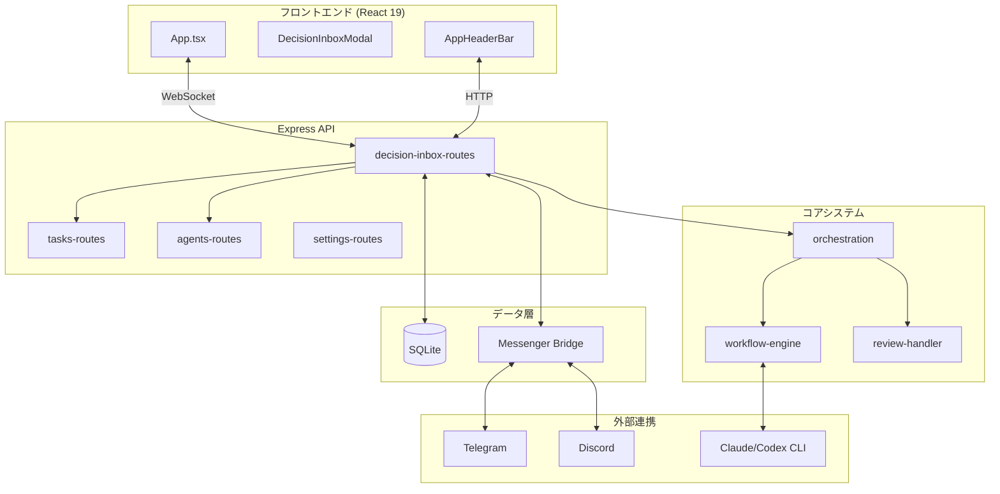

# Claw-Empire プロジェクト連携仕様書

**作成日**: 2026-03-08
**担当**: Development Team (Bolt)

---

## 1. 概要

本ドキュメントはDecisionInbox機能とClaw-Empireプロジェクト全体との連携仕様を定義する。

---

## 2. システムアーキテクチャ

### 2.1 全体構成図



---

## 3. データフロー

### 3.1 DecisionInbox アイテム生成フロー

```
1. タスク完了 → agent完了メッセージ送信
2. orchestrationレビュー判定
3. DecisionInboxアイテム生成
4. DB保存 (decision_inbox_state)
5. WebSocketブロードキャスト (decision_inbox_update)
6. Messenger通知送信 (Telegram/Discord)
```

### 3.2 決定返信フロー

```
1. ユーザーがオプション選択
2. POST /api/decision-inbox/:id/reply
3. 決定ハンドラー実行 (project-review-reply / review-round-reply / timeout-reply)
4. タスク状態更新
5. 次工程実行 (subtask delegation / review round / task execution)
6. Messenger通知送信
7. WebSocketブロードキャスト
```

---

## 4. Workflow Pack 連携

### 4.1 対応Workflow Pack

| Pack Key              | DecisionInbox 対応 | 特殊動作                             |
| :-------------------- | :----------------- | :----------------------------------- |
| `development`         | ✅                 | 通常の開発ワークフロー               |
| `report`              | ✅                 | レポート生成QAゲート                 |
| `video_preprod`       | ✅                 | アーティファクトゲート、YOLOスキップ |
| `web_research_report` | ✅                 | 引用チェックゲート                   |
| `novel`               | ✅                 | キャラクター一貫性チェック           |
| `roleplay`            | ❌                 | 即時応答、DecisionInbox不要          |

### 4.2 Pack別決定種類

| Pack                | 使用する決定種類                                           |
| :------------------ | :--------------------------------------------------------- |
| development         | `task_timeout_resume`, `review_round_pick`                 |
| report              | `project_review_ready`, `review_round_pick`                |
| video_preprod       | `project_review_ready` (YOLOスキップ), `review_round_pick` |
| web_research_report | `project_review_ready`, `review_round_pick`                |
| novel               | `review_round_pick`                                        |

---

## 5. データベース連携

### 5.1 関連テーブル

```sql
-- メインタスク
tasks
├── id (PK)
├── workflow_pack_key -- DecisionInbox参照
├── status -- pending/working/review/done
├── project_id -- プロジェクトレビュー参照
└── workflow_meta_json -- Pack固有メタデータ

-- プロジェクト
projects
├── id (PK)
├── default_pack_key -- セッションデフォルト
└── created_at

-- 決定状態
project_review_decision_state
├── project_id (PK → projects.id)
├── snapshot_hash -- 変更検出
├── state_json -- 決定状態
└── events_json -- 決定履歴

review_round_decision_state
├── task_id (PK → tasks.id)
├── snapshot_hash -- 変更検出
├── state_json -- 決定状態
└── events_json -- 決定履歴
```

### 5.2 外部キー関係

```
tasks.id
  ↓ (FK)
review_round_decision_state.task_id

projects.id
  ↓ (FK)
project_review_decision_state.project_id

tasks.project_id
  ↓ (FK)
projects.id

subtasks.parent_task_id
  ↓ (FK)
tasks.id
```

---

## 6. API 連携

### 6.1 DecisionInbox が使用するAPI

| エンドポイント                       | 用途             |
| :----------------------------------- | :--------------- |
| `GET /api/decision-inbox`            | アイテム一覧取得 |
| `POST /api/decision-inbox/:id/reply` | 決定返信         |
| `GET /api/tasks/:id`                 | タスク詳細取得   |
| `PATCH /api/tasks/:id`               | タスク状態更新   |
| `POST /api/tasks/:id/subtasks`       | サブタスク委任   |
| `POST /api/subtasks`                 | サブタスク作成   |
| `GET /api/agents`                    | エージェント一覧 |
| `GET /api/departments`               | 部門一覧         |

### 6.2 他機能からDecisionInboxを使用するケース

| 機能           | 連携方法                                 |
| :------------- | :--------------------------------------- |
| タスク完了     | 自動アイテム生成                         |
| メッセンジャー | `tryHandleInboxDecisionReply()` 経由返信 |
| レビュー完了   | `review_round_pick` アイテム生成         |
| YOLOモード     | `applyDecisionReply()` 自動実行          |

---

## 7. WebSocket 連携

### 7.1 DecisionInbox関連イベント

| イベント名              | 方向          | データ                       |
| :---------------------- | :------------ | :--------------------------- |
| `decision_inbox_update` | Server→Client | `{ count: number }`          |
| `task_update`           | Server→Client | タスク情報（レビュー完了時） |
| `subtask_update`        | Server→Client | サブタスク情報（委任時）     |

### 7.2 クライアント側実装

```typescript
// src/hooks/useWebSocket.ts (既存)
useEffect(() => {
  ws.on("decision_inbox_update", (data) => {
    // アイテムカウント更新
    setDecisionInboxCount(data.count);
  });
}, []);
```

---

## 8. メッセンジャー連携

### 8.1 通知フロー

```
┌─────────────┐    ┌─────────────┐    ┌──────────────┐
│ Decision    │───>│ Messenger   │───>│ Telegram     │
│ Inbox       │    │ Bridge      │    │ Bot          │
└─────────────┘    └─────────────┘    └──────────────┘
       │                   │
       │                   └─────────────>│ Discord      │
       │                                 │ Webhook      │
       └─────────────────────────────────┴──────────────┘
```

### 8.2 通知フォーマット

**場所**: `server/modules/routes/ops/messages/decision-inbox/messenger-notice-format.ts`

各プラットフォーム向けに整形されたメッセージ生成。

---

## 9. Workflow Pack 拡張時の連携

### 9.1 新規Pack追加時の必要作業

1. `workflow_packs` テーブルに追加
2. Pack用QAルール定義
3. DecisionInbox対応種類決定
4. 必要に応じてスキップロジック追加

### 9.2 Pack拡張テンプレート

```typescript
// 新規Pack用 DecisionInbox ハンドラー例
export function handleNewPackDecisionReply({ currentItem, selectedOption, deps }: DecisionReplyInput): boolean {
  if (currentItem.kind !== "new_pack_decision") return false;

  // Pack固有の決定ロジック実装
  // ...

  return true;
}
```

---

## 10. トラブルシューティング

### 10.1 既知の問題

| 問題                   | 原因               | 対応                                                 |
| :--------------------- | :----------------- | :--------------------------------------------------- |
| アイテット重複表示     | ポーリング競合     | `yoloAutopilotInFlight` ロック                       |
| メッセンジャー通知遅延 | バックログ積増     | `flushDecisionInboxMessengerNotices` forceオプション |
| video_preprod自動決定  | YOLOスキップ未動作 | スキップロジック確認                                 |

### 10.2 デバッグ方法

```bash
# DecisionInbox アイテム確認
curl http://localhost:3000/api/decision-inbox

# 決定返信テスト
curl -X POST http://localhost:3000/api/decision-inbox/:id/reply \
  -H "Content-Type: application/json" \
  -d '{"option_number": 1}'

# ログ確認
tail -f logs/decision-inbox.log
```

---

## 11. 将来の拡張項目

| 優先度 | 機能                   | 説明                         |
| :----- | :--------------------- | :--------------------------- |
| High   | 決定テンプレート       | よく使う返信をテンプレート化 |
| Medium | 決定分析ダッシュボード | 決定パターン分析             |
| Medium | カスタムWorkflow Pack  | ユーザー定義Pack             |
| Low    | マルチ言語UI拡張       | 現在4言語対応、追加言語      |

---

**付録: 連携インターフェース定義**

```typescript
// DecisionInbox Bridge Interface
export interface DecisionInboxRouteBridge {
  tryHandleInboxDecisionReply(input: DecisionReplyBridgeInput): Promise<DecisionReplyBridgeResult>;
}

// Messenger Bridge Interface
export interface MessengerBridgeInput {
  db: Database;
  nowMs: () => number;
  getPreferredLanguage: (ctx: any) => string;
  normalizeTextField: (val: unknown) => string | null;
  getDecisionInboxItems: () => DecisionInboxRouteItem[];
  applyDecisionReply: (
    decisionId: string,
    body: Record<string, unknown>,
  ) => { status: number; payload: Record<string, unknown> };
}
```
