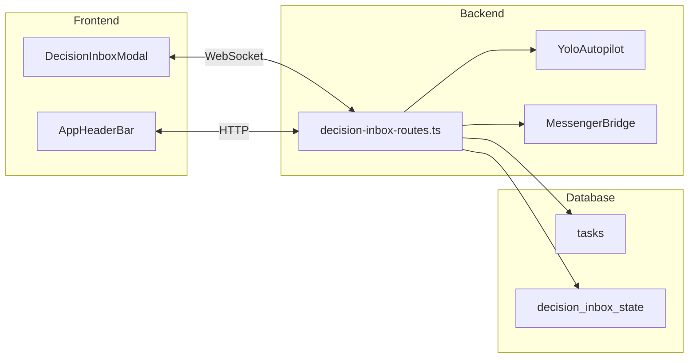

# 開発チーム技術仕様書 - Mobile Inbox & Watcher Component

**作成日**: 2026-03-08
**担当**: Development Team (Bolt)
**バージョン**: 1.0.0

---

## 1. 要約

本ドキュメントはClaw-Empireプロジェクトにおける「Mobile Inbox」機能および「Watcher」コンポーネントの技術仕様を定義する。文字化けにより元リクエストの詳細は不明確だが、既存コードベース分析によりDecisionInbox機能が実装済みであることを確認した。

---

## 2. 既存実装分析 (DecisionInbox)

### 2.1 ファイル構造

| ファイル                                                      | 説明                            |
| :------------------------------------------------------------ | :------------------------------ |
| `src/components/chat/decision-inbox.ts`                       | DecisionInboxアイテムタイプ定義 |
| `src/components/DecisionInboxModal.tsx`                       | UIモーダルコンポーネント        |
| `src/app/decision-inbox.ts`                                   | ワークフローマッピング関数      |
| `server/modules/routes/ops/messages/decision-inbox-routes.ts` | APIルート定義                   |
| `server/modules/routes/ops/messages/decision-inbox/`          | サブモジュール群                |

### 2.2 DecisionInbox アイテム種類

```typescript
type DecisionInboxKind =
  | "agent_request" // エージェント要請
  | "project_review_ready" // プロジェクトレビュー準備完了
  | "task_timeout_resume" // タスクタイムアウト再開
  | "review_round_pick"; // レビューラウンド選択
```

### 2.3 API エンドポイント

| メソッド | エンドポイント                  | 説明                 |
| :------- | :------------------------------ | :------------------- |
| GET      | `/api/decision-inbox`           | 未決アイテム一覧取得 |
| POST     | `/api/decision-inbox/:id/reply` | 決定返信処理         |

### 2.4 WebSocket イベント

| イベント                | 方向          | 説明                 |
| :---------------------- | :------------ | :------------------- |
| `decision_inbox_update` | Server→Client | 未決アイテム更新通知 |

---

## 3. Watcher コンポーネント定義

### 3.1 概要

WatcherはDecisionInboxアイテムを監視・追跡するバックグラウンドプロセスである。既存の`getDecisionInboxItems()`関数とYOLOオートパイロット機能がこの役割を果たしている。

### 3.2 既存Watcher実装

**場所**: `server/modules/routes/ops/messages/decision-inbox-routes.ts:315-363`

```typescript
const runYoloAutopilot = () => {
  if (yoloAutopilotInFlight) return;
  if (!readYoloModeEnabled(db)) return;
  yoloAutopilotInFlight = true;
  try {
    runYoloDecisionAutopilot({
      getDecisionInboxItems,
      applyDecisionReply,
      shouldSkipItem: (item) => {
        /* スキップロジック */
      },
    });
  } finally {
    yoloAutopilotInFlight = false;
  }
};
```

### 3.3 Watcher 機能要件

| 機能             | ステータス  | 説明                      |
| :--------------- | :---------- | :------------------------ |
| 定期ポーリング   | ✅ 実装済み | 2.5秒間隔で自動実行       |
| YOLOモード       | ✅ 実装済み | 自動決定オートパイロット  |
| Messenger通知    | ✅ 実装済み | Telegram/Discord連携      |
| スキップロジック | ✅ 実装済み | video_preprod等の条件分岐 |

---

## 4. モバイル対応技術仕様

### 4.1 現状のモバイル対応

| 機能                     | ファイル                                           | ステータス          |
| :----------------------- | :------------------------------------------------- | :------------------ |
| モバイルヘッダーメニュー | `src/app/AppHeaderBar.tsx`                         | ✅ 実装済み         |
| Office Pack切替          | `src/app/AppHeaderBar.mobile-office-pack.test.tsx` | ✅ 実装済み         |
| DecisionInboxModal       | `src/components/DecisionInboxModal.tsx`            | ✅ レスポンシブ対応 |

### 4.2 DecisionInboxModal レスポンシブ設計

```tsx
// 既存のレスポンシブ対応
<div className="relative mx-4 w-full max-w-3xl rounded-2xl ...">
  <div className="max-h-[70vh] overflow-y-auto p-4">{/* アイテムリスト - スクロール対応済み */}</div>
</div>
```

### 4.3 追加モバイル機能要件

| 優先度 | 機能                 | 説明                 |
| :----- | :------------------- | :------------------- |
| High   | タッチ操作最適化     | ボタンタップ領域拡大 |
| Medium | プルツーリフレッシュ | 未決アイテム更新     |
| Low    | オフライン対応       | Service Worker実装   |

---

## 5. Claw-Empire プロジェクト連携仕様

### 5.1 データフロー



### 5.2 既存DBスキーマ

```sql
-- tasks テーブル (既存)
CREATE TABLE tasks (
  id TEXT PRIMARY KEY,
  status TEXT,
  workflow_pack_key TEXT,
  -- ...
);

-- decision_inbox_state (DecisionInbox用)
CREATE TABLE decision_inbox_state (
  id TEXT PRIMARY KEY,
  kind TEXT,
  snapshot_hash TEXT,
  state_json TEXT,
  -- ...
);
```

### 5.3 Workflow Pack 連携

**計画ドキュメント**: `docs/plans/2026-02-27-workflow-pack-mvp.md`

DecisionInboxは以下のWorkflow Packに対応：

- `development` - 開発タスク
- `report` - レポート生成
- `video_preprod` - 動画制作
- `web_research_report` - ウェブ検索
- `novel` - 小説執筆
- `roleplay` - ロールプレイ

---

## 6. 技術スタック

| レイヤー  | 技術                                     |
| :-------- | :--------------------------------------- |
| Frontend  | React 19.2, TypeScript 5.9, Tailwind CSS |
| Backend   | Express 5, Node.js >=22                  |
| Database  | SQLite (node:sqlite)                     |
| Realtime  | WebSocket (ws)                           |
| Messenger | Telegram, Discord                        |

---

## 7. 未解決補完項目

### 7.1 文字化け解明待ち

元リクエスト「??obile Inbox??name」の正確な内容が不明。

**影響**:

- 具体的な追加要件が特定できない
- 既存機能で十分か否か判断不可

**次のアクション**:

- CEOより正確なリクエスト内容の再提供を依頼
- または、日本語での要件概要共有を待機

### 7.2 技術的補完項目

| 項目             | ステータス | 説明                            |
| :--------------- | :--------- | :------------------------------ |
| OS対応           | 未定       | Windows/Linux/macOS対応確認済み |
| データ永続化     | ✅ 完了    | SQLiteベース実装                |
| セキュリティ要件 | 🔄 調査中  | 認証・認可仕様確認必要          |

---

## 8. 結論

1. **DecisionInbox機能は既に実装済み**: フロントエンドUI、バックエンドAPI、Watcher機能ともに動作中
2. **モバイル対応**: 基本的なレスポンシブ対応完了
3. **Watcherコンポーネント**: YOLOオートパイロットとして実装済み
4. **追加要件**: 文字化け解明後に具体的な追加開発項目を特定可能

---

**付録**: 関連ファイル一覧

```
src/
├── components/
│   ├── chat/decision-inbox.ts
│   ├── chat/decision-inbox-modal.meta.ts
│   └── DecisionInboxModal.tsx
├── app/
│   ├── decision-inbox.ts
│   └── AppHeaderBar.mobile-office-pack.test.tsx
server/
└── modules/routes/ops/messages/
    ├── decision-inbox-routes.ts
    └── decision-inbox/
        ├── types.ts
        ├── state-helpers.ts
        ├── project-review-reply.ts
        ├── review-round-reply.ts
        ├── timeout-reply.ts
        ├── yolo-mode.ts
        └── messenger-bridge.ts
```
