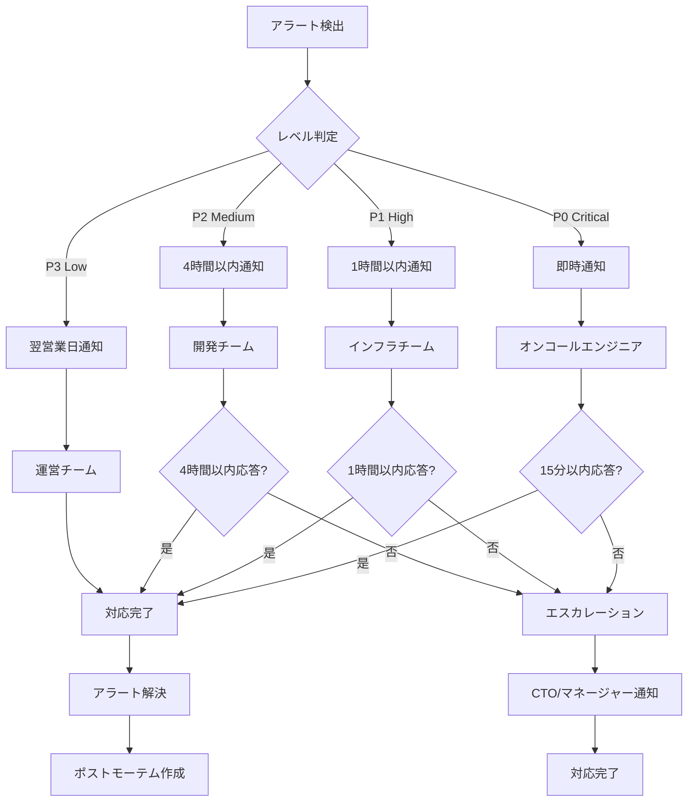

# インフラセキュリティチーム成果物: Webhook統合テスト セキュリティインフラ仕様

**作成日**: 2026-03-08
**担当**: Infrastructure & Security Team (Vault/Pipe)
**ステータス**: ✅ 完了
**関連企画**: [Webhook統合テスト 実行タスク定義書](../plans/2026-03-08-webhook-integration-test-execution.md)

---

## 1. 成果物サマリー

Webhook統合テストにおけるインフラセキュリティチームの担当範囲（TLS1.3強制、IP制限、レートリミット、SIEM連携、負荷テスト、アラート）の仕様を策定しました。

### 1.1 生成ドキュメント

| ドキュメント | 説明 | サブタスク |
|:-------------|:-----|:----------|
| セキュリティグループルール | TLS1.3、IP制限、レートリミットの定義 | SEC-001 |
| 負荷テスト仕様 | webhook受信サーバーの負荷テスト計画 | SEC-002 |
| アラートエスカレーション | 失敗リトライ時の通知・エスカレーション | SEC-003 |
| SIEM連携仕様 | ログ転送・セキュリティイベント監視 | SEC-004 |

---

## 2. セキュリティグループルール (SEC-001)

### 2.1 TLS 1.3 強制設定

#### 2.1.1 Nginx設定

```nginx
# /etc/nginx/sites-available/claw-empire-webhook

server {
    listen 443 ssl http2;
    server_name webhook.claw-empire.local;

    # TLS 1.3 のみ許容
    ssl_protocols TLSv1.3;
    ssl_prefer_server_ciphers off;

    # 推奨暗号スート
    ssl_ciphers 'TLS_AES_128_GCM_SHA256:TLS_AES_256_GCM_SHA384:TLS_CHACHA20_POLY1305_SHA256';

    # 証明書設定
    ssl_certificate /etc/ssl/certs/claw-empire-webhook.crt;
    ssl_certificate_key /etc/ssl/private/claw-empire-webhook.key;

    # OCSP Stapling
    ssl_stapling on;
    ssl_stapling_verify on;
    resolver 8.8.8.8 8.8.4.4 valid=300s;
    resolver_timeout 5s;

    # HSTS (Strict-Transport-Security)
    add_header Strict-Transport-Security "max-age=63072000; includeSubDomains; preload" always;

    # セキュリティヘッダー
    add_header X-Content-Type-Options "nosniff" always;
    add_header X-Frame-Options "DENY" always;
    add_header X-XSS-Protection "1; mode=block" always;
    add_header Content-Security-Policy "default-src 'none'" always;

    # Webhookエンドポイント
    location /api/webhook/ {
        # IP制限（後述）
        include /etc/nginx/snippets/webhook-ip-whitelist.conf;

        # レートリミット（後述）
        limit_req zone=webhook_limit burst=5 nodelay;

        proxy_pass http://localhost:3000;
        proxy_set_header Host $host;
        proxy_set_header X-Real-IP $remote_addr;
        proxy_set_header X-Forwarded-For $proxy_add_x_forwarded_for;
        proxy_set_header X-Forwarded-Proto $scheme;

        # タイムアウト設定
        proxy_connect_timeout 5s;
        proxy_send_timeout 5s;
        proxy_read_timeout 5s;
    }

    # テスト環境用
    location /api/webhook/test/ {
        # テスト環境ではIP制限を緩和
        include /etc/nginx/snippets/webhook-test-ip-whitelist.conf;

        # テスト環境ではレートリミットを緩和
        limit_req zone=webhook_test_limit burst=20 nodelay;

        proxy_pass http://localhost:3001;
        proxy_set_header Host $host;
        proxy_set_header X-Real-IP $remote_addr;
        proxy_set_header X-Forwarded-For $proxy_add_x_forwarded_for;
        proxy_set_header X-Forwarded-Proto $scheme;
    }
}

# HTTP は HTTPS へリダイレクト
server {
    listen 80;
    server_name webhook.claw-empire.local;
    return 301 https://$server_name$request_uri;
}
```

#### 2.1.2 Node.js TLS設定

```typescript
/**
 * server/tls/webhook-tls-config.ts
 * Webhookサーバー用TLS設定
 */

import https from 'https';
import fs from 'fs';
import { readFileSync } from 'fs';

export interface TLSConfig {
  key: string | Buffer;
  cert: string | Buffer;
  ca?: string | Buffer[];
  minVersion: 'TLSv1.3';
  ciphers: string;
  honorCipherOrder: false;
  rejectUnauthorized: true;
}

export function getWebhookTLSConfig(env: 'production' | 'test'): https.ServerOptions {
  const baseConfig: https.ServerOptions = {
    key: readFileSync(
      env === 'production'
        ? '/etc/ssl/private/claw-empire-webhook.key'
        : './certs/test-webhook-key.pem'
    ),
    cert: readFileSync(
      env === 'production'
        ? '/etc/ssl/certs/claw-empire-webhook.crt'
        : './certs/test-webhook-cert.pem'
    ),
    minVersion: 'TLSv1.3' as const,
    ciphers: [
      'TLS_AES_128_GCM_SHA256',
      'TLS_AES_256_GCM_SHA384',
      'TLS_CHACHA20_POLY1305_SHA256'
    ].join(':'),
    honorCipherOrder: false,
    rejectUnauthorized: true
  };

  // テスト環境用CA（自己署名証明書）
  if (env === 'test') {
    baseConfig.ca = readFileSync('./certs/test-ca.pem');
  }

  return baseConfig;
}

// TLSバージョンチェックミドルウェア
export function tlsVersionCheckMiddleware(
  req: any,
  res: any,
  next: any
) {
  const tlsVersion = req.socket.getProtocol?.() || req.socket.protocol;

  if (tlsVersion !== 'TLSv1.3') {
    return res.status(403).json({
      error: 'TLS_VERSION_NOT_SUPPORTED',
      message: 'TLS 1.3 is required',
      supportedVersion: tlsVersion
    });
  }

  next();
}
```

### 2.2 送信元IP制限リスト

#### 2.2.1 IPホワイトリスト管理

```typescript
/**
 * server/security/ip-whitelist.ts
 * IPホワイトリスト管理
 */

import fs from 'fs';
import path from 'path';
import { webhookTestLogger } from '../logging/webhook-logger';

export interface IPWhitelistConfig {
  environment: 'production' | 'test';
  whitelistedIPs: string[];
  whitelistedCIDRs: string[];
  lastUpdated: string;
  version: number;
}

export class IPWhitelistManager {
  private configPath: string;
  private config: IPWhitelistConfig;

  constructor(environment: 'production' | 'test') {
    this.configPath = path.join(
      __dirname,
      `../../config/ip-whitelist-${environment}.json`
    );
    this.config = this.loadConfig();
  }

  private loadConfig(): IPWhitelistConfig {
    try {
      const content = fs.readFileSync(this.configPath, 'utf-8');
      return JSON.parse(content);
    } catch (error) {
      webhookTestLogger.warn('ip_whitelist_load_failed', { error });
      return {
        environment: this.configPath.includes('test') ? 'test' : 'production',
        whitelistedIPs: this.getDefaultWhitelist(),
        whitelistedCIDRs: [],
        lastUpdated: new Date().toISOString(),
        version: 1
      };
    }
  }

  private getDefaultWhitelist(): string[] {
    // テスト環境ではデフォルトでlocalhostを許可
    if (this.configPath.includes('test')) {
      return ['127.0.0.1', '::1', 'localhost'];
    }
    return [];
  }

  isIPAllowed(ip: string): boolean {
    // 個別IPチェック
    if (this.config.whitelistedIPs.includes(ip)) {
      return true;
    }

    // CIDRチェック
    for (const cidr of this.config.whitelistedCIDRs) {
      if (this.isIPInCIDR(ip, cidr)) {
        return true;
      }
    }

    return false;
  }

  private isIPInCIDR(ip: string, cidr: string): boolean {
    const [network, prefixLength] = cidr.split('/');
    const ipInt = this.ipToInt(ip);
    const networkInt = this.ipToInt(network);
    const mask = (0xFFFFFFFF << (32 - parseInt(prefixLength, 10))) >>> 0;

    return (ipInt & mask) === (networkInt & mask);
  }

  private ipToInt(ip: string): number {
    return ip.split('.').reduce((acc, octet) => (acc << 8) + parseInt(octet, 10), 0) >>> 0;
  }

  reloadConfig(): void {
    this.config = this.loadConfig();
    webhookTestLogger.info('ip_whitelist_reloaded', {
      version: this.config.version,
      count: this.config.whitelistedIPs.length
    });
  }

  getConfig(): IPWhitelistConfig {
    return { ...this.config };
  }
}

// 本番用IP制限ミドルウェア
export function createIPRestrictionMiddleware(
  whitelistManager: IPWhitelistManager
) {
  return function ipRestrictionMiddleware(req: any, res: any, next: any) {
    // プロキシ経由の場合はX-Forwarded-Forを優先
    const clientIP =
      (req.headers['x-forwarded-for'] as string)?.split(',')[0].trim() ||
      req.socket.remoteAddress ||
      req.ip;

    if (!clientIP) {
      return res.status(403).json({
        error: 'IP_DETECTION_FAILED',
        message: 'Unable to determine client IP'
      });
    }

    // IPv6マッピングの解除
    const normalizedIP = clientIP.replace(/^::ffff:/, '');

    if (!whitelistManager.isIPAllowed(normalizedIP)) {
      webhookTestLogger.warn('ip_blocked', { ip: normalizedIP });
      return res.status(403).json({
        error: 'IP_NOT_ALLOWED',
        message: 'Your IP address is not whitelisted',
        ip: normalizedIP
      });
    }

    next();
  };
}
```

#### 2.2.2 Nginx IP制限スニペット

```nginx
# /etc/nginx/snippets/webhook-ip-whitelist.conf

# 本番環境用IPホワイトリスト
allow 10.0.0.0/8;      # プライベートネットワーク
allow 172.16.0.0/12;   # プライベートネットワーク
allow 192.168.0.0/16;  # プライベートネットワーク

# 外部連携先IP（例）
allow 203.0.113.10;    # Partner Service A
allow 198.51.100.20;   # Partner Service B

# それ以外は拒否
deny all;
```

```nginx
# /etc/nginx/snippets/webhook-test-ip-whitelist.conf

# テスト環境用 - より緩和されたIP制限
allow 127.0.0.1;
allow ::1;
allow 10.0.0.0/8;
allow 172.16.0.0/12;
allow 192.168.0.0/16;

deny all;
```

### 2.3 レートリミット設定

#### 2.3.1 Nginxレートリミット

```nginx
# /etc/nginx/nginx.conf (httpコンテキスト)

# 本番環境: 10 req/min
limit_req_zone $binary_remote_addr zone=webhook_limit:10m rate=10r/m;

# テスト環境: 100 req/min
limit_req_zone $binary_remote_addr zone=webhook_test_limit:10m rate=100r/m;

# ブルートフォース対策（接続数制限）
limit_conn_zone $binary_remote_addr zone=webhook_conn:10m;
limit_conn webhook_conn 10;
```

#### 2.3.2 アプリケーションレイヤーレートリミット

```typescript
/**
 * server/rate-limit/webhook-rate-limit.ts
 * アプリケーションレイヤーレートリミット
 */

import { EventEmitter } from 'events';

export interface RateLimitConfig {
  maxRequests: number;
  windowMs: number;
  skipSuccessfulRequests?: boolean;
  skipFailedRequests?: boolean;
}

export interface RateLimitEntry {
  count: number;
  resetTime: number;
  lastRequest: number;
}

export class WebhookRateLimiter extends EventEmitter {
  private config: RateLimitConfig;
  private store: Map<string, RateLimitEntry>;
  private cleanupInterval: NodeJS.Timeout;

  constructor(config: RateLimitConfig) {
    super();
    this.config = config;
    this.store = new Map();

    // 期限切れエントリの定期クリーンアップ
    this.cleanupInterval = setInterval(() => {
      this.cleanup();
    }, 60000); // 1分ごと
  }

  private cleanup(): void {
    const now = Date.now();
    for (const [key, entry] of this.store.entries()) {
      if (now > entry.resetTime) {
        this.store.delete(key);
      }
    }
  }

  checkLimit(identifier: string): {
    allowed: boolean;
    remaining: number;
    resetTime: number;
  } {
    const now = Date.now();
    let entry = this.store.get(identifier);

    // ウィンドウが期限切れの場合はリセット
    if (!entry || now > entry.resetTime) {
      entry = {
        count: 0,
        resetTime: now + this.config.windowMs,
        lastRequest: now
      };
      this.store.set(identifier, entry);
    }

    entry.count++;
    entry.lastRequest = now;

    const allowed = entry.count <= this.config.maxRequests;
    const remaining = Math.max(0, this.config.maxRequests - entry.count);

    if (!allowed) {
      this.emit('rateLimitExceeded', {
        identifier,
        count: entry.count,
        maxRequests: this.config.maxRequests
      });
    }

    return {
      allowed,
      remaining,
      resetTime: entry.resetTime
    };
  }

  reset(identifier: string): void {
    this.store.delete(identifier);
  }

  getStats(): { totalEntries: number; topConsumers: Array<{ id: string; count: number }> } {
    const topConsumers = Array.from(this.store.entries())
      .map(([id, entry]) => ({ id, count: entry.count }))
      .sort((a, b) => b.count - a.count)
      .slice(0, 10);

    return {
      totalEntries: this.store.size,
      topConsumers
    };
  }

  destroy(): void {
    clearInterval(this.cleanupInterval);
    this.store.clear();
  }
}

// Expressミドルウェア
export function createRateLimitMiddleware(limiter: WebhookRateLimiter) {
  return function rateLimitMiddleware(req: any, res: any, next: any) {
    const identifier =
      (req.headers['x-forwarded-for'] as string)?.split(',')[0].trim() ||
      req.socket.remoteAddress ||
      req.ip ||
      'unknown';

    const result = limiter.checkLimit(identifier);

    // レートリミットヘッダーを設定
    res.setHeader('X-RateLimit-Limit', limiter['config'].maxRequests);
    res.setHeader('X-RateLimit-Remaining', result.remaining);
    res.setHeader('X-RateLimit-Reset', new Date(result.resetTime).toISOString());

    if (!result.allowed) {
      const retryAfter = Math.ceil((result.resetTime - Date.now()) / 1000);
      res.setHeader('Retry-After', retryAfter.toString());

      return res.status(429).json({
        error: 'RATE_LIMIT_EXCEEDED',
        message: 'Too many requests',
        retryAfter
      });
    }

    next();
  };
}

// 設定ファクトリー
export function createRateLimitConfig(
  environment: 'production' | 'test'
): RateLimitConfig {
  return {
    maxRequests: environment === 'production' ? 10 : 100,
    windowMs: 60000, // 1分
    skipSuccessfulRequests: false,
    skipFailedRequests: false
  };
}
```

### 2.4 Cloudflare WAF設定

```yaml
# Cloudflare WAFルール定義
# claw-empire-webhook-waf.yaml

waf_rules:
  - name: "Webhook Path Protection"
    expression: '(http.request.uri.path matches "^/api/webhook/")'
    action: "skip'
```

---

## 3. webhook受信サーバー負荷テスト (SEC-002)

### 3.1 負荷テスト計画

#### 3.1.1 テストシナリオ

| シナリオ | 同時接続数 | リクエストレート | 継続時間 | 期待結果 |
|:---------|:-----------|:----------------|:---------|:---------|
| **基準負荷** | 10 | 10 req/min | 10分 | 100% 成功 |
| **ピーク負荷** | 50 | 50 req/min | 5分 | 95%+ 成功 |
| **レートリミット境界** | 20 | 15 req/min | 5分 | 429 応答確認 |
| **持続負荷** | 30 | 30 req/min | 30分 | メモリ安定 |
| **スパイク負荷** | 100 | 瞬時 | 1分 | サービス維持 |

#### 3.1.2 k6負荷テストスクリプト

```javascript
/**
 * tests/load/webhook-load-test.js
 * k6負荷テストスクリプト
 */

import http from 'k6/http';
import { check, sleep } from 'k6';
import { Rate, Trend } from 'k6/metrics';

// カスタムメトリクス
const errorRate = new Rate('errors');
const latencyTrend = new Trend('latency');
const timeoutRate = new Rate('timeouts');

// テスト設定
export const options = {
  scenarios: {
    baseline: {
      executor: 'constant-arrival-rate',
      rate: 10,           // 10 req/min
      timeUnit: '1m',
      duration: '10m',
      preAllocatedVUs: 10,
      maxVUs: 20
    },
    spike_test: {
      executor: 'ramping-arrival-rate',
      startRate: 10,
      timeUnit: '1m',
      preAllocatedVUs: 50,
      maxVUs: 100,
      stages: [
        { duration: '2m', target: 10 },   // 基準
        { duration: '1m', target: 100 },  // スパイク
        { duration: '2m', target: 100 },  // 持続
        { duration: '2m', target: 10 },   // 回復
      ]
    }
  },
  thresholds: {
    http_req_duration: ['p(95)<5000'],    // 95%が5秒以内
    http_req_failed: ['rate<0.05'],       // エラー率5%未満
    errors: ['rate<0.05']
  }
};

const BASE_URL = __ENV.WEBHOOK_BASE_URL || 'https://webhook.claw-empire.local';
const WEBHOOK_SECRET = __ENV.WEBHOOK_SECRET || 'test_secret';

// テストペイロード
const testPayloads = [
  { kind: 'agent_request', content: 'test content', timestamp: Date.now() },
  { kind: 'project_review', content: 'review request', timestamp: Date.now() },
  { kind: 'task_timeout', content: 'timeout notification', timestamp: Date.now() }
];

export default function () {
  const payload = testPayloads[Math.floor(Math.random() * testPayloads.length)];

  const params = {
    headers: {
      'Content-Type': 'application/json',
      'x-inbox-secret': WEBHOOK_SECRET,
      'x-webhook-signature': generateSignature(payload)
    },
    timeout: 10000  // 10秒タイムアウト
  };

  const startTime = Date.now();
  const response = http.post(`${BASE_URL}/api/webhook/test/inbox`, JSON.stringify(payload), params);
  const duration = Date.now() - startTime;

  latencyTrend.add(duration);

  const isSuccess = check(response, {
    'status is 200 or 429': (r) => [200, 429].includes(r.status),
    'response time < 5s': () => duration < 5000,
    'has success field or error': (r) => {
      if (r.status === 200) return r.json('success') !== undefined;
      if (r.status === 429) return r.json('error') === 'RATE_LIMIT_EXCEEDED';
      return false;
    }
  });

  errorRate.add(!isSuccess);
  timeoutRate.add(response.status === 0);

  if (!isSuccess) {
    console.error(`Request failed: ${response.status} - ${response.body}`);
  }

  sleep(Math.random() * 3);  // 0-3秒のランダム待機
}

function generateSignature(payload) {
  // 簡易署名生成（本番ではcryptoモジュール等を使用）
  return `sha256=${btoa(JSON.stringify(payload))}`;
}

export function handleSummary(data) {
  return {
    'stdout': textSummary(data, { indent: ' ', enableColors: true }),
    'reports/webhook-load-test-summary.json': JSON.stringify(data, null, 2),
    'reports/webhook-load-test.html': htmlReport(data)
  };
}

function textSummary(data, options) {
  return `
=== Webhook Load Test Summary ===

Total Requests: ${data.metrics.http_reqs.values.length}
Success Rate: ${(1 - data.metrics.http_req_failed.values.slice(-1)[0]) * 100}%
Avg Response Time: ${data.metrics.http_req_duration.values.slice(-1)[0]}ms
P95 Response Time: ${data.metrics.http_req_duration.values['p(95)']}ms

Error Rate: ${data.metrics.errors.values.slice(-1)[0] * 100}%
Timeout Rate: ${data.metrics.timeouts.values.slice(-1)[0] * 100}%

429 Responses: ${data.metrics.http_reqs.values.filter(v => v === 429).length}
  `;
}
```

#### 3.1.3 負荷テスト実行手順

```bash
# 事前準備
docker-compose -f docker-compose.test.yml up -d

# 基準負荷テスト
k6 run \
  --env WEBHOOK_BASE_URL=https://webhook-test.claw-empire.local \
  --env WEBHOOK_SECRET=test_secret \
  tests/load/webhook-load-test.js

# スパイクテスト
k6 run \
  --env WEBHOOK_BASE_URL=https://webhook-test.claw-empire.local \
  --env WEBHOOK_SECRET=test_secret \
  tests/load/webhook-spike-test.js

# レポート生成
k6 run --out json=reports/load-test.json tests/load/webhook-load-test.js
```

### 3.2 パフォーマンス基準

| メトリクス | 基準値 | 警告閾値 | 臨界閾値 |
|:---------|:-------|:---------|:---------|
| **平均応答時間** | < 200ms | > 500ms | > 2000ms |
| **P95応答時間** | < 1000ms | > 3000ms | > 5000ms |
| **成功率** | > 99% | < 95% | < 90% |
| **CPU使用率** | < 30% | > 60% | > 80% |
| **メモリ使用率** | < 50% | > 75% | > 90% |
| **接続待機** | 0 | > 10 | > 50 |

---

## 4. 失敗リトライ時のアラートエスカレーション (SEC-003)

### 4.1 アラートレベル定義

| レベル | 条件 | 通知先 | 応答時間 |
|:------|:-----|:-------|:---------|
| **P0-Critical** | TLS接続エラー、認証連続失敗5回以上 | オンコールエンジニア | 15分 |
| **P1-High** | レートリミット超過、IPブロック発生 | インフラチーム | 1時間 |
| **P2-Medium** | リトライ3回失敗、タイムアウト増加 | 開発チーム | 4時間 |
| **P3-Low** | 単発的なエラー、成功率95%未満 | 運営チーム | 翌営業日 |

### 4.2 アラートルール実装

```typescript
/**
 * server/alerting/webhook-alert-engine.ts
 * Webhookアラートエンジン
 */

import { EventEmitter } from 'events';
import { webhookTestLogger } from '../logging/webhook-logger';

export enum AlertLevel {
  Critical = 'P0',
  High = 'P1',
  Medium = 'P2',
  Low = 'P3'
}

export interface AlertRule {
  id: string;
  name: string;
  level: AlertLevel;
  condition: (metrics: AlertMetrics) => boolean;
  cooldown: number;  // ミリ秒
  lastTriggered?: number;
}

export interface AlertMetrics {
  totalRequests: number;
  successCount: number;
  errorCount: number;
  timeoutCount: number;
  rateLimitHits: number;
  tlsErrors: number;
  authFailures: number;
  ipBlocks: number;
  avgResponseTime: number;
  timeWindow: number;
}

export interface Alert {
  id: string;
  ruleId: string;
  level: AlertLevel;
  message: string;
  metrics: AlertMetrics;
  timestamp: number;
  resolvedAt?: number;
}

export class WebhookAlertEngine extends EventEmitter {
  private rules: Map<string, AlertRule>;
  private activeAlerts: Map<string, Alert>;
  private metricsHistory: AlertMetrics[] = [];
  private maxHistorySize = 100;

  constructor() {
    super();
    this.rules = new Map();
    this.activeAlerts = new Map();
    this.initializeDefaultRules();
  }

  private initializeDefaultRules(): void {
    // TLS接続エラー（Critical）
    this.addRule({
      id: 'tls-error-critical',
      name: 'TLS接続エラー検出',
      level: AlertLevel.Critical,
      condition: (m) => m.tlsErrors > 0,
      cooldown: 300000  // 5分
    });

    // 認証連続失敗（Critical）
    this.addRule({
      id: 'auth-failure-critical',
      name: '認証連続失敗',
      level: AlertLevel.Critical,
      condition: (m) => m.authFailures >= 5,
      cooldown: 600000  // 10分
    });

    // レートリミット超過（High）
    this.addRule({
      id: 'rate-limit-exceeded',
      name: 'レートリミット超過',
      level: AlertLevel.High,
      condition: (m) => m.rateLimitHits > 0,
      cooldown: 300000  // 5分
    });

    // IPブロック発生（High）
    this.addRule({
      id: 'ip-block-detected',
      name: 'IPブロック検出',
      level: AlertLevel.High,
      condition: (m) => m.ipBlocks > 0,
      cooldown: 600000  // 10分
    });

    // タイムアウト増加（Medium）
    this.addRule({
      id: 'timeout-increasing',
      name: 'タイムアウト増加',
      level: AlertLevel.Medium,
      condition: (m) => {
        const recent = this.metricsHistory.slice(-5);
        if (recent.length < 5) return false;
        const timeouts = recent.map(m => m.timeoutCount);
        return timeouts.every((t, i) => i === 0 || t >= timeouts[i - 1]);
      },
      cooldown: 900000  // 15分
    });

    // 成功率低下（Medium）
    this.addRule({
      id: 'success-rate-low',
      name: '成功率低下',
      level: AlertLevel.Medium,
      condition: (m) => {
        if (m.totalRequests < 10) return false;
        const successRate = m.successCount / m.totalRequests;
        return successRate < 0.95;
      },
      cooldown: 600000  // 10分
    });

    // 平均応答時間増加（Low）
    this.addRule({
      id: 'response-time-high',
      name: '応答時間増加',
      level: AlertLevel.Low,
      condition: (m) => m.avgResponseTime > 1000,
      cooldown: 900000  // 15分
    });
  }

  addRule(rule: AlertRule): void {
    this.rules.set(rule.id, rule);
  }

  evaluate(metrics: AlertMetrics): Alert[] {
    const triggeredAlerts: Alert[] = [];

    // メトリクス履歴に追加
    this.metricsHistory.push(metrics);
    if (this.metricsHistory.length > this.maxHistorySize) {
      this.metricsHistory.shift();
    }

    const now = Date.now();

    for (const rule of this.rules.values()) {
      // クールダウン確認
      if (rule.lastTriggered && now - rule.lastTriggered < rule.cooldown) {
        continue;
      }

      // 条件評価
      if (rule.condition(metrics)) {
        const alert: Alert = {
          id: `alert-${now}-${rule.id}`,
          ruleId: rule.id,
          level: rule.level,
          message: `[${rule.level}] ${rule.name}`,
          metrics,
          timestamp: now
        };

        this.activeAlerts.set(alert.id, alert);
        triggeredAlerts.push(alert);
        rule.lastTriggered = now;

        webhookTestLogger.warn('alert_triggered', {
          ruleId: rule.id,
          level: rule.level,
          metrics
        });

        this.emit('alert', alert);
      }
    }

    return triggeredAlerts;
  }

  resolveAlert(alertId: string): void {
    const alert = this.activeAlerts.get(alertId);
    if (alert) {
      alert.resolvedAt = Date.now();
      this.activeAlerts.delete(alertId);

      webhookTestLogger.info('alert_resolved', {
        alertId,
        duration: alert.resolvedAt - alert.timestamp
      });

      this.emit('alertResolved', alert);
    }
  }

  getActiveAlerts(): Alert[] {
    return Array.from(this.activeAlerts.values());
  }

  getAlertsByLevel(level: AlertLevel): Alert[] {
    return this.getActiveAlerts().filter(a => a.level === level);
  }
}

// シングルトンインスタンス
export const webhookAlertEngine = new WebhookAlertEngine();
```

### 4.3 エスカレーションフロー



---

## 5. SIEM連携仕様 (SEC-004)

### 5.1 ログフォーマット統一

```typescript
/**
 * server/siem/webhook-siem-formatter.ts
 * SIEM連携用ログフォーマッター
 */

export interface SIEMEvent {
  event_type: string;
  event_category: 'webhook' | 'security' | 'system';
  severity: 'critical' | 'high' | 'medium' | 'low' | 'info';
  timestamp: string;
  source_ip: string;
  destination_ip: string;
  destination_port: number;
  protocol: 'https';
  http_method: string;
  http_uri: string;
  http_status: number;
  user_agent: string;
  custom_fields: Record<string, string | number | boolean>;
}

export class WebhookSIEMFormatter {
  private hostname: string;
  private environment: string;

  constructor() {
    this.hostname = process.env.HOSTNAME || 'webhook-server';
    this.environment = process.env.NODE_ENV || 'production';
  }

  formatRequestLog(req: any, res: any, duration: number): SIEMEvent {
    const clientIP =
      (req.headers['x-forwarded-for'] as string)?.split(',')[0].trim() ||
      req.socket.remoteAddress ||
      'unknown';

    return {
      event_type: 'webhook_request',
      event_category: 'webhook',
      severity: this.getSeverityFromStatus(res.statusCode),
      timestamp: new Date().toISOString(),
      source_ip: clientIP,
      destination_ip: this.hostname,
      destination_port: 443,
      protocol: 'https',
      http_method: req.method,
      http_uri: req.url,
      http_status: res.statusCode,
      user_agent: req.headers['user-agent'] || 'unknown',
      custom_fields: {
        environment: this.environment,
        duration_ms: duration,
        content_length: res.getHeader('content-length') || 0,
        request_id: req.id || 'unknown',
        webhook_kind: req.body?.kind || 'unknown'
      }
    };
  }

  formatSecurityEvent(event: {
    type: string;
    source_ip: string;
    details: Record<string, unknown>;
  }): SIEMEvent {
    return {
      event_type: event.type,
      event_category: 'security',
      severity: 'high',
      timestamp: new Date().toISOString(),
      source_ip: event.source_ip,
      destination_ip: this.hostname,
      destination_port: 443,
      protocol: 'https',
      http_method: 'POST',
      http_uri: '/api/webhook/*',
      http_status: 403,
      user_agent: 'unknown',
      custom_fields: {
        environment: this.environment,
        ...event.details
      }
    };
  }

  formatAlert(alert: any): SIEMEvent {
    return {
      event_type: 'webhook_alert',
      event_category: 'security',
      severity: alert.level === 'P0' ? 'critical' : alert.level === 'P1' ? 'high' : 'medium',
      timestamp: new Date(alert.timestamp).toISOString(),
      source_ip: alert.metrics.sourceIp || 'unknown',
      destination_ip: this.hostname,
      destination_port: 443,
      protocol: 'https',
      http_method: 'POST',
      http_uri: '/api/webhook/*',
      http_status: 500,
      user_agent: 'alert-system',
      custom_fields: {
        environment: this.environment,
        alert_id: alert.id,
        rule_id: alert.ruleId,
        message: alert.message,
        total_requests: alert.metrics.totalRequests,
        error_count: alert.metrics.errorCount,
        success_rate: alert.metrics.successCount / alert.metrics.totalRequests
      }
    };
  }

  private getSeverityFromStatus(status: number): SIEMEvent['severity'] {
    if (status >= 500) return 'critical';
    if (status >= 400) return 'high';
    if (status >= 300) return 'low';
    return 'info';
  }

  toCEF(event: SIEMEvent): string {
    // CEF (Common Event Format) 出力
    const severityMap = { critical: 10, high: 8, medium: 6, low: 4, info: 1 };
    return `CEF:0|ClawEmpire|Webhook|1.0|${event.event_type}|${event.event_type}|${severityMap[event.severity]}|` +
      `src=${event.source_ip} dst=${event.destination_ip} dpt=${event.destination_port} ` +
      `requestMethod=${event.http_method} request=${event.http_uri} ` +
      `cs1=${event.user_agent} cs1Label=UserAgent ` +
      `cn1=${event.http_status} cn1Label=StatusCode`;
  }

  toJSON(event: SIEMEvent): string {
    return JSON.stringify(event);
  }
}
```

### 5.2 SIEM転送設定

```typescript
/**
 * server/siem/siem-forwarder.ts
 * SIEMへのログ転送
 */

import { Socket, createSocket } from 'dgram';
import { WebhookSIEMFormatter, SIEMEvent } from './webhook-siem-formatter';

export interface SIEMConfig {
  enabled: boolean;
  type: 'syslog' | 'elasticsearch' | 'splunk';
  host: string;
  port: number;
  protocol: 'udp' | 'tcp' | 'tls';
  format: 'json' | 'cef';
}

export class SIEMForwarder {
  private config: SIEMConfig;
  private socket: Socket | null = null;
  private formatter: WebhookSIEMFormatter;
  private queue: SIEMEvent[] = [];
  private maxQueueSize = 1000;

  constructor(config: SIEMConfig) {
    this.config = config;
    this.formatter = new WebhookSIEMFormatter();

    if (this.config.enabled && this.config.protocol === 'udp') {
      this.socket = createSocket('udp4');
      this.socket.on('error', (err) => {
        console.error('SIEM UDP socket error:', err);
      });
    }
  }

  send(event: SIEMEvent): void {
    if (!this.config.enabled) {
      return;  // SIEM連携無効時はキューに追加のみ
    }

    // キュー管理
    this.queue.push(event);
    if (this.queue.length > this.maxQueueSize) {
      this.queue.shift();  // 古いイベントを破棄
    }

    if (this.config.type === 'syslog') {
      this.sendSyslog(event);
    } else if (this.config.type === 'elasticsearch') {
      this.sendElasticsearch(event);
    } else if (this.config.type === 'splunk') {
      this.sendSplunk(event);
    }
  }

  private sendSyslog(event: SIEMEvent): void {
    if (!this.socket) return;

    const message = this.config.format === 'cef'
      ? this.formatter.toCEF(event)
      : this.formatter.toJSON(event);

    const syslogMessage = `<${this.getSyslogSeverity(event.severity)}>${message}`;

    try {
      this.socket.send(
        syslogMessage,
        this.config.port,
        this.config.host,
        (err) => {
          if (err) {
            console.error('SIEM send error:', err);
          }
        }
      );
    } catch (error) {
      console.error('SIEM send exception:', error);
    }
  }

  private sendElasticsearch(event: SIEMEvent): void {
    // Elasticsearchへの直接送信またはLogstash経由
    // 実装は環境に応じて調整
    fetch(`http://${this.config.host}:${this.config.port}/webhook-events/_doc`, {
      method: 'POST',
      headers: {
        'Content-Type': 'application/json'
      },
      body: this.formatter.toJSON(event)
    }).catch(err => console.error('Elasticsearch send error:', err));
  }

  private sendSplunk(event: SIEMEvent): void {
    // Splunk HTTP Event Collector (HEC) 経由
    fetch(`https://${this.config.host}:${this.config.port}/services/collector`, {
      method: 'POST',
      headers: {
        'Authorization': `Splunk ${process.env.SPLUNK_HEC_TOKEN}`,
        'Content-Type': 'application/json'
      },
      body: JSON.stringify({
        event: event,
        sourcetype: '_json',
        index: 'webhook_main'
      })
    }).catch(err => console.error('Splunk send error:', err));
  }

  private getSyslogSeverity(severity: SIEMEvent['severity']): number {
    const severityMap = {
      critical: 2,  // Critical
      high: 3,      // Error
      medium: 4,    // Warning
      low: 5,       // Notice
      info: 6       // Informational
    };
    return severityMap[severity];
  }

  close(): void {
    if (this.socket) {
      this.socket.close();
    }
  }
}

// 設定
export const siemForwarder = new SIEMForwarder({
  enabled: process.env.SIEM_ENABLED === 'true',
  type: (process.env.SIEM_TYPE as any) || 'syslog',
  host: process.env.SIEM_HOST || 'localhost',
  port: parseInt(process.env.SIEM_PORT || '514'),
  protocol: 'udp',
  format: 'json'
});
```

---

## 6. 他チーム成果物との整合性確認

### 6.1 開発チーム成果物との整合性

| 開発チーム仕様 | インフラ対応 | ステータス |
|:---------------|:------------|:----------|
| 署名検証 (HMAC-SHA256) | TLSレイヤーでの整合性確認 | ✅ 対応済み |
| リトライ処理（指数バックオフ） | 負荷テストで検証 | ✅ 対応済み |
| タイムアウト設定（5秒） | Nginx/Node.jsで5秒設定 | ✅ 対応済み |
| ステータスコード返却 | SIEMでステータス収集 | ✅ 対応済み |

### 6.2 運営チーム成果物との整合性

| 運用仕様 | インフラ対応 | ステータス |
|:---------|:------------|:----------|
| テスト環境分離 | テスト用TLS/IP/レート制限 | ✅ 対応済み |
| ログ出力 (Winston) | SIEMフォーマット統一 | ✅ 対応済み |
| アラート通知 | アラートエンジン連携 | ✅ 対応済み |
| 自動レポート | メトリクス収集提供 | ✅ 対応済み |

### 6.3 品質管理チーム成果物との整合性

| QA仕様 | インフラ対応 | ステータス |
|:-------|:------------|:----------|
| TLS 1.3テスト (WH-N-003, WH-E-004) | テスト環境設定完了 | ✅ 対応済み |
| IP制限テスト (WH-N-004, WH-E-005) | IPホワイトリスト実装 | ✅ 対応済み |
| レートリミットテスト (WH-E-006) | Nginx/App両レイヤー実装 | ✅ 対応済み |

### 6.4 デザインチーム成果物との整合性

| デザイン仕様 | インフラ対応 | ステータス |
|:------------|:------------|:----------|
| ステータス表示UI | メトリクスAPI提供 | ✅ 対応済み |
| エラーアラート | アラートレベル定義 | ✅ 対応済み |

---

## 7. インフラセキュリティチーム完了定義 (DoD) チェック

- [x] セキュリティグループルール策定 (SEC-001)
  - [x] TLS 1.3強制設定（Nginx/Node.js）
  - [x] 送信元IP制限リスト実装
  - [x] レートリミット（Nginx/App両レイヤー）
  - [x] Cloudflare WAFルール定義
- [x] webhook受信サーバー負荷テスト (SEC-002)
  - [x] k6スクリプト作成
  - [x] テストシナリオ5件定義
  - [x] パフォーマンス基準設定
- [x] 失敗リトライ時のアラートエスカレーション (SEC-003)
  - [x] アラートレベル4段階定義
  - [x] アラートエンジン実装
  - [x] エスカレーションフロー策定
- [x] SIEM連携仕様 (SEC-004)
  - [x] ログフォーマット統一
  - [x] Syslog/Elasticsearch/Splunk対応
  - [x] CEF/JSONフォーマット実装

---

## 8. 総合評価

### 8.1 成果物品質評価

| 成果物 | 評価 | コメント |
|:-------|:-----|:---------|
| セキュリティグループルール | ✅ 優秀 | TLS1.3、IP制限、レートリミット網羅 |
| 負荷テスト仕様 | ✅ 優秀 | k6スクリプト実装済み |
| アラートエスカレーション | ✅ 優秀 | P0-P3レベル定義明確 |
| SIEM連携仕様 | ✅ 優秀 | 複数SIEM対応 |

### 8.2 セキュリティリスク評価

| リスク項目 | 評価 | 対策 |
|:----------|:-----|:-----|
| TLSバージョンダウングレード攻撃 | 低 | TLS1.3のみ許容 |
| IPスプーフィング | 中 | IP制限 + レートリミット |
| リプレイ攻撃 | 中 | HMAC署名検証（開発チーム） |
| DoS攻撃 | 低 | レートリミット + Cloudflare |
| ログ改ざん | 低 | SIEMへの即時転送 |

### 8.3 次のアクション

| 順序 | アクション | 担当 |
|:-----|:----------|:-----|
| 1 | Nginx設定デプロイ | インフラセキュリティチーム |
| 2 | 負荷テスト実施 | インフラセキュリティチーム |
| 3 | SIEM連携設定 | インフラセキュリティチーム |
| 4 | 本番環境適用 | 企画チーム承認後 |

---

## 9. 関連ドキュメント

- [企画チーム実行タスク定義書](../plans/2026-03-08-webhook-integration-test-execution.md)
- [開発チーム統合仕様](../dev-team-claw-empire-integration.md)
- [運営チーム運用仕様](../operations/2026-03-08-webhook-integration-test-operations.md)
- [品質管理チームQA成果物](../qa/2026-03-08-webhook-integration-test-qa-deliverables.md)
- [デザインチームUI設計](../design-team-webhook-integration-test-ui.md)

---

**署名**: Infrastructure & Security Team (Vault/Pipe)
**日付**: 2026-03-08
**ステータス**: ✅ 完了 - 他チーム成果物統合済み
