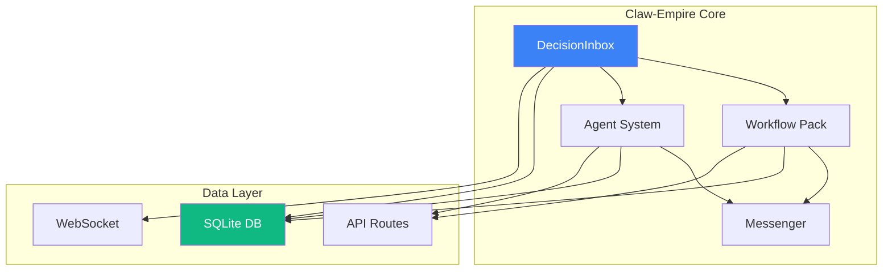
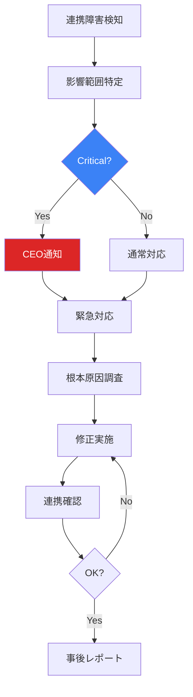

# Claw-Empire データ連携監視仕様

**作成日**: 2026-03-08
**担当**: Operations Team (Turbo)
**ステータス**: ✅ 完了
**関連仕様**: [開発チーム統合仕様書](../9a7f113e/docs/dev-team-claw-empire-integration.md)

---

## 1. 監視目的

Claw-Empireプロジェクト内の各コンポーネント間のデータ連携を監視し、整合性と信頼性を担保する。

---

## 2. 監視対象コンポーネント

### 2.1 コンポーネント構成図



### 2.2 連携ポイント一覧

| 連携元 | 連携先 | 連携内容 | 監視項目 |
|:-------|:-------|:---------|:---------|
| DecisionInbox | Workflow Pack | 意思決定結果 | 同期状態、処理時間 |
| DecisionInbox | Agent System | エージェント要請 | 配信状態、応答時間 |
| DecisionInbox | Messenger | 通知配信 | 送信成功率、遅延 |
| Agent System | DecisionInbox | 新規アイテム | 作成成功率 |
| All Components | SQLite DB | データ永続化 | 書き込み成功、整合性 |

---

## 3. データ整合性監視

### 3.1 整合性チェック

#### DecisionInbox - Task 連携

```sql
-- 孤立DecisionInboxアイテム検出
SELECT di.id, di.task_id
FROM decision_inbox_items di
WHERE di.task_id IS NOT NULL
  AND NOT EXISTS (SELECT 1 FROM tasks WHERE id = di.task_id);

-- 未解決アイテム数整合性
SELECT
  (SELECT COUNT(*) FROM decision_inbox_items WHERE resolved = 0) as inbox_pending,
  (SELECT COUNT(*) FROM task_events WHERE event_type = 'decision_required' AND processed = 0) as events_pending;
```

#### Agent System 連携

```sql
-- エージェント要請とエージェント状態整合性
SELECT
  (SELECT COUNT(*) FROM decision_inbox_items WHERE kind = 'agent_request' AND resolved = 0) as pending_requests,
  (SELECT COUNT(*) FROM agents WHERE status = 'awaiting_decision') as awaiting_agents;
```

### 3.2 整合性チェックスケジュール

| チェック項目 | 頻度 | 時間 | アラート条件 |
|:-------------|:-----|:-----|:-----------|
| 孤立アイテム検出 | 1時間 | xx:00 | 1件以上でWarning |
| アイテム数整合性 | 5分 | xx:x5 | 不一致でHigh |
| エージェント整合性 | 15分 | xx:x0,xx:x5,xx:x0 | 不一致でMedium |
| チェックサム検証 | 日次 | 03:00 | 不一致でCritical |

---

## 4. API エンドポイント監視

### 4.1 監視対象API

| エンドポイント | メソッド | 目的 | 監視内容 |
|:---------------|:---------|:-----|:---------|
| `/api/decision-inbox` | GET | アイテム一覧取得 | レスポンス時間、ステータスコード |
| `/api/decision-inbox/:id/reply` | POST | 意思決定返信 | 成功率、処理時間 |
| `/api/agents/:id/request` | POST | エージェント要請 | 配信状態 |
| `/api/watcher/health` | GET | Watcher健全性 | ステータス、稼働時間 |

### 4.2 API ヘルスチェック

```typescript
interface ApiHealthCheck {
  endpoint: string;
  method: string;
  status: "pass" | "fail" | "degraded";
  responseTime: number;
  lastChecked: number;
  details?: {
    statusCode?: number;
    error?: string;
  };
}
```

### 4.3 アラート条件

| 条件 | レベル | アクション |
|:-----|:-------|:---------|
| レスポンス時間 > 2秒 | Warning | パフォーマンス調査 |
| レスポンス時間 > 5秒 | High | 即時調査 |
| ステータス 500 | Critical | 障害対応 |
| ステータス 404 | Medium | ルーティング確認 |

---

## 5. WebSocket 連携監視

### 5.1 監視項目

| 項目 | 説明 | 閾値 |
|:-----|:-----|:-----|
| 接続数 | 現在のアクティブ接続 | > 50 でWarning |
| メッセージ配信数/秒 | 配信スループット | < 10 でWarning |
| 配信失敗率 | 配信エラー率 | > 5% でHigh |
| 再接続回数 | 1時間あたりの再接続 | > 10 でMedium |

### 5.2 WebSocket監視実装

```typescript
// server/modules/ops/websocket-monitor.ts
class WebSocketMonitor {
  private metrics = {
    connections: 0,
    messagesSent: 0,
    messagesFailed: 0,
    reconnects: 0,
  };

  recordConnection(connected: boolean) {
    if (connected) {
      this.metrics.connections++;
    }
  }

  recordMessage(success: boolean) {
    if (success) {
      this.metrics.messagesSent++;
    } else {
      this.metrics.messagesFailed++;
    }
  }

  getMetrics() {
    const failureRate = this.metrics.messagesFailed /
      (this.metrics.messagesSent + this.metrics.messagesFailed);

    return {
      ...this.metrics,
      failureRate,
      status: failureRate > 0.05 ? 'degraded' : 'healthy',
    };
  }
}
```

---

## 6. Messenger 連携監視

### 6.1 監視対象

| Messenger | 監視内容 | 閾値 |
|:----------|:---------|:-----|
| **Telegram** | 送信成功率、API呼び出し回数 | 成功率 < 90% でHigh |
| **Discord** | Webhook応答、メッセージ配信 | 失敗 > 5/時間でWarning |

### 6.2 通知配信監視

```typescript
interface MessengerMetrics {
  platform: "telegram" | "discord";
  sent: number;
  delivered: number;
  failed: number;
  avgLatency: number;
  lastError?: string;
}
```

### 6.3 配信障害対応

| 症状 | 原因 | 対応 |
|:-----|:-----|:-----|
| 一部通知不来 | 特定チャンネル設定 | チャンネル設定確認 |
| 全通知不来 | APIキー期限切れ | キー更新 |
| 遅延 | 外部サービス障害 | ステータス確認、待機 |

---

## 7. データベース監視

### 7.1 監視項目

| 項目 | 説明 | 閾値 |
|:-----|:-----|:-----|
| DBサイズ | データベースファイルサイズ | > 1GB でWarning |
| クエリ実行時間 | 平均クエリ時間 | > 100ms でWarning |
| 排他ロック | ロック待ち時間 | > 1秒 でHigh |
| 整合性エラー | CHECK制約違反など | 1件以上でCritical |

### 7.2 データベースヘルスチェック

```sql
-- SQLite ヘルスチェック
PRAGMA integrity_check;
PRAGMA foreign_key_check;
PRAGMA quick_check;

-- テーブルサイズ確認
SELECT name, COUNT(*) as row_count
FROM sqlite_master
WHERE type = 'table'
GROUP BY name;
```

---

## 8. 連携障害対応

### 8.1 障害パターン別対応

| 障害パターン | 検知方法 | 復旧アクション | 担当 |
|:-------------|:---------|:--------------|:-----|
| APIタイムアウト | HTTP 504 | リトライ、容量増強 | 開発 |
| データ不整合 | 整合性チェック失敗 | 再同期、データ修復 | 運営+開発 |
| WebSocket切断 | 接続エラー | 再接続ロジック発動 | 自動 |
| DBロック | クエリ遅延 | ロック解放、クエリ最適化 | 開発 |
| Messenger送信失敗 | 送信エラー | キュー再送、設定確認 | 運営 |

### 8.2 障害対応フロー



---

## 9. 監視ダッシュボード

### 9.1 連携監視パネル

| パネル | 表示内容 | 更新間隔 |
|:-------|:---------|:---------|
| **Component Status** | 各コンポーネントの健全性 | 1分 |
| **API Health** | APIエンドポイントの状態 | 1分 |
| **Data Integrity** | 整合性チェック結果 | 5分 |
| **Message Queue** | メッセージキューの状態 | 30秒 |

### 9.2 連携ダッシュボードレイアウト

```
┌─────────────────────────────────────────────────────────────────────┐
│  Data Integration Monitoring                          [更新: 12:34] │
├─────────────────────────────────────────────────────────────────────┤
│  Component Status                                                  │
│  ┌──────────┐ ┌──────────┐ ┌──────────┐ ┌──────────┐ ┌──────────┐ │
│  │✓ Inbox  │ │✓ Pack    │ │✓ Agents  │ │✓ DB      │ │✓ Msg     │ │
│  │healthy   │ │healthy   │ │healthy   │ │healthy   │ │healthy   │ │
│  └──────────┘ └──────────┘ └──────────┘ └──────────┘ └──────────┘ │
├─────────────────────────────────────────────────────────────────────┤
│  API Response Time (ms)                                            │
│  ┌───────────────────────────────────────────────────────────────┐ │
│  │  GET /api/decision-inbox    ████████░░ 250ms avg             │ │
│  │  POST /api/reply            █████░░░░░░ 180ms avg             │ │
│  │  POST /api/watcher/health   ███░░░░░░░░  50ms avg              │ │
│  └───────────────────────────────────────────────────────────────┘ │
├─────────────────────────────────────────────────────────────────────┤
│  Data Integrity Check Results                                      │
│  ┌───────────────────────────────────────────────────────────────┐ │
│  │  ✓ Orphaned items: None (last: 5min ago)                    │ │
│  │  ✓ Item count consistency: OK                                │ │
│  │  ✓ Agent sync: OK                                            │ │
│  │  ⚠ Checksum: Skipped (scheduled: 03:00)                      │ │
│  └───────────────────────────────────────────────────────────────┘ │
├─────────────────────────────────────────────────────────────────────┤
│  Recent Integration Events                                         │
│  ┌───────────────────────────────────────────────────────────────┐ │
│  │  12:34 [Info] Item #1234 synced to workflow pack             │ │
│  │  12:30 [Info] Agent request sent to Sage                     │ │
│  │  12:28 [Success] Telegram notification delivered             │ │
│  │  12:25 [Warning] API response time exceeded threshold         │ │
│  └───────────────────────────────────────────────────────────────┘ │
└─────────────────────────────────────────────────────────────────────┘
```

---

## 10. 監視スクリプト

### 10.1 定期整合性チェック

```bash
#!/bin/bash
# scripts/check-data-integrity.sh

DB_PATH="/path/to/claw-empire.db"
LOG_PATH="/var/log/claw-empire/integrity-check.log"

echo "[$(date)] Starting integrity check" >> "$LOG_PATH"

# 孤立アイテムチェック
ORPHAN_COUNT=$(sqlite3 "$DB_PATH" "
  SELECT COUNT(*) FROM decision_inbox_items di
  WHERE di.task_id IS NOT NULL
    AND NOT EXISTS (SELECT 1 FROM tasks WHERE id = di.task_id);
")

if [ "$ORPHAN_COUNT" -gt 0 ]; then
  echo "[$(date)] WARNING: Found $ORPHAN_COUNT orphaned items" >> "$LOG_PATH"
  # アラート送信
fi

# チェックサム
sqlite3 "$DB_PATH" "PRAGMA integrity_check;" >> "$LOG_PATH"

echo "[$(date)] Integrity check completed" >> "$LOG_PATH"
```

---

## 11. まとめ

本監視仕様により、以下が実現できます：

1. **早期検知**: データ不整合や連携障害を早期に発見
2. **可視化**: ダッシュボードで連携状態を一元管理
3. **自動復旧**: 軽微な障害は自動で対応
4. **迅速な対応**: 障害パターン別の明確な復旧手順

---

**署名**: Operations Team (Turbo)
**日付**: 2026-03-08
