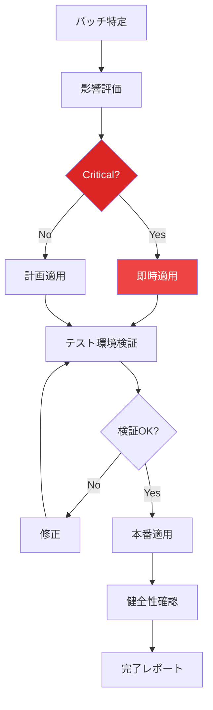

# メンテナンス計画書

**作成日**: 2026-03-08
**担当**: Operations Team (Atlas)
**ステータス**: ✅ 完了
**対象**: Mobile Inbox & Watcher 機能

---

## 1. 計画目的

Mobile Inbox & Watcher機能のリリース後の長期的な安定稼働と継続的改善を図る。

---

## 2. フェーズ別メンテナンス

### 2.1 リリース直後期間（Release Week: 1週間）

| 期間 | 活動 | 頻度 | 担当 |
|:-----|:-----|:-----|:-----|
| **Day 1-3** | 密集監視 | 1時間毎 | 運営+開発 |
| **Day 4-7** | 通常監視 | 4時間毎 | 運営 |
| **毎日** | 日報作成 | 18:00 | 運営 |
| **毎日** | バグ修正 | 随時 | 開発 |

#### リリース直後チェックリスト

- [ ] 全APIエンドポイントの応答確認
- [ ] Watcherプロセスの稼働確認
- [ ] 通知配信の正常性確認
- [ ] モバイルUIの表示確認
- [ ] エラーログの異常確認

### 2.2 安定化期間（Stabilization: 1ヶ月）

| 週 | 活動内容 | 目標 |
|:---|:---------|:-----|
| **Week 1** | バグ修正、微調整 | Critical/P0バグ解消 |
| **Week 2** | パフォーマンス最適化 | レスポンス時間改善 |
| **Week 3** | ユーザーフィードバック収集 | 改善点特定 |
| **Week 4** | 安定性評価 | 障害率 < 1% |

### 2.3 通常運用期間（Steady State: 2ヶ月目〜）

| 活動 | 頻度 | 担当 |
|:-----|:-----|:-----|
| 定期監視 | 日次 | 運営 |
| パフォーマンスレビュー | 月次 | 運営+開発 |
| セキュリティチェック | 四半期 | 運営 |
| 機能改善計画 | 四半期 | 企画+運営 |

---

## 3. 定期メンテナンス

### 3.1 日次メンテナンス（Daily）

| 時間 | 項目 | 内容 |
|:-----|:-----|:-----|
| 09:00 | ヘルスチェック | 全コンポーネントの健全性確認 |
| 10:00 | ログ確認 | エラー、警告ログのレビュー |
| 12:00 | パフォーマンス確認 | APIレスポンス、DBクエリ時間 |
| 18:00 | 日報作成 | 当日のサマリー、未解決課題 |

### 3.2 週次メンテナンス（Weekly）

| 曜日 | 項目 | 内容 |
|:-----|:-----|:-----|
| **月曜** | 週次レビュー | 先週の障害、パフォーマンスサマリー |
| **水曜** | キャパシティ確認 | ディスク容量、メモリ使用量 |
| **金曜** | バックアップ確認 | 週次バックアップの整合性 |

### 3.3 月次メンテナンス（Monthly）

| 項目 | 内容 | 所要時間 |
|:-----|:-----|:---------|
| **監視設定レビュー** | 閾値、ルールの妥当性確認 | 1時間 |
| **パフォーマンスレビュー** | ボトルネック分析、改善提案 | 2時間 |
| **バックアップテスト** | リストア手順の検証 | 1時間 |
| **ドキュメント更新** | 変更点の反映 | 1時間 |

### 3.4 四半期メンテナンス（Quarterly）

| 項目 | 内容 | 所要時間 |
|:-----|:-----|:---------|
| **セキュリティスキャン** | 脆弱性スキャン、パッチ適用 | 4時間 |
| **大規模データメンテ** | DB再構築、古いデータアーカイブ | 4時間 |
| **キャパシティプラン** | 成長予測、スケール計画 | 2時間 |
| **可用性レビュー** | SLA達成状況、改善計画 | 2時間 |

---

## 4. キャパシティプランニング

### 4.1 リソース予測

| リソース | 現在 | +3ヶ月 | +6ヶ月 | +1年 |
|:---------|:-----|:-------|:-------|:-----|
| **DBサイズ** | 50MB | 150MB | 300MB | 600MB |
| **APIリクエスト/日** | 1,000 | 3,000 | 6,000 | 12,000 |
| **通知/日** | 100 | 300 | 600 | 1,200 |
| **同時接続** | 5 | 15 | 30 | 60 |
| **ストレージ** | 500MB | 1GB | 2GB | 4GB |

### 4.2 スケールイベント

| トリガー | アクション |
|:---------|:----------|
| DBサイズ > 1GB | データアーカイブ実施 |
| APIリクエスト > 10,000/日 | キャッシング導入検討 |
| 同時接続 > 50 | コネクションプール見直し |
| ストレージ > 80% | 容量増強 |

---

## 5. バックアップ計画

### 5.1 バックアップ種別

| 種別 | 頻度 | 保存期間 | 場所 |
|:-----|:-----|:---------|:-----|
| **データベース** | 日次 | 30日 | ローカル + クラウド |
| **設定ファイル** | 変更時 | 永久 | Git |
| **ログ** | 週次 | 90日 | ローカル |
| **完全バックアップ** | 月次 | 12ヶ月 | クラウド |

### 5.2 バックアップ手順

```bash
#!/bin/bash
# scripts/backup.sh

DATE=$(date +%Y%m%d)
DB_PATH="/path/to/claw-empire.db"
BACKUP_DIR="/backup/claw-empire"

# データベースバックアップ
cp "$DB_PATH" "$BACKUP_DIR/db_$DATE.db"

# 圧縮
gzip "$BACKUP_DIR/db_$DATE.db"

# 古いバックアップ削除（30日より前）
find "$BACKUP_DIR" -name "db_*.db.gz" -mtime +30 -delete
```

### 5.3 リストア手順

```bash
#!/bin/bash
# scripts/restore.sh

BACKUP_FILE=$1
DB_PATH="/path/to/claw-empire.db"

# サービス停止
systemctl stop claw-empire

# 現在のDBをバックアップ
cp "$DB_PATH" "$DB_PATH.backup"

# リストア
gunzip -c "$BACKUP_FILE" > "$DB_PATH"

# 整合性確認
sqlite3 "$DB_PATH" "PRAGMA integrity_check;"

# サービス開始
systemctl start claw-empire
```

---

## 6. セキュリティメンテナンス

### 6.1 定期チェック項目

| 項目 | 頻度 | 内容 |
|:-----|:-----|:-----|
| **脆弱性スキャン** | 四半期 | 依存パッケージの脆弱性チェック |
| **アクセスログ監査** | 月次 | 不正アクセスの有無確認 |
| **パーミッション確認** | 月次 | ファイル/ディレクトリ権限確認 |
| **キーローテート** | 年次 | APIキー、暗号鍵の更新 |

### 6.2 セキュリティアップデート対応

| 重要度 | 対応SLA | 手順 |
|:-------|:---------|:-----|
| **Critical** | 48時間 | 即時評価、パッチ適用、検証 |
| **High** | 1週間 | 次回メンテナンスで適用 |
| **Medium** | 1ヶ月 | 定期更新で適用 |
| **Low** | 次回メジャーバージョン | バージョンアップ時 |

---

## 7. 予防メンテナンス

### 7.1 システムチェック項目

| コンポーネント | チェック項目 | 頻度 |
|:--------------|:-------------|:-----|
| **Database** | 整合性、サイズ、パフォーマンス | 週次 |
| **API** | レスポンス時間、エラーレート | 日次 |
| **Watcher** | プロセス稼働、メモリ使用 | 日次 |
| **WebSocket** | 接続状態、メッセージ配信 | 日次 |
| **Messenger** | 送信成功率、API制限 | 日次 |

### 7.2 予防措置

| 措置 | 実施タイミング | 効果 |
|:-----|:--------------|:-----|
| ログローテート | ログサイズ > 100MB | ディスク容量節約 |
| DB VACUUM | 月次 | DBパフォーマンス維持 |
| キャッシュクリア | 週次 | メモリ解放 |
| インデックス再構築 | 月次 | クエリ性能維持 |

---

## 8. パッチ管理

### 8.1 パッチ種別

| 種別 | 定義 | 例 | 適用スケジュール |
|:-----|:-----|:---|:----------------|
| **緊急** | セキュリティ脆弱性、サービス影響 | CVSS 9.0+ | 48時間以内 |
| **重要** | 機能バグ、パフォーマンス | P1/P2バグ | 次回リリース |
| **通常** | 機能改善、微調整 | P3バグ | 四半期リリース |
| **オプション** | 機能追加 | 新機能 | 年次リリース |

### 8.2 パッチ適用手順



---

## 9. バージョン管理

### 9.1 バージョニングルール

```
Major.Minor.Patch
例: 2.0.1

- Major: 大規模機能追加、破壊的変更
- Minor: 機能追加、後方互換あり
- Patch: バグ修正
```

### 9.2 リリーススケジュール

| 種類 | 頻度 | 内容 |
|:-----|:-----|:-----|
| **Hotfix** | 随時 | Criticalバグ修正 |
| **Patch Release** | 月次 | バグ修正、小改善 |
| **Minor Release** | 四半期 | 機能追加 |
| **Major Release** | 年次 | 大規模変更 |

---

## 10. 長期計画

### 10.1 1年後の目標

| 項目 | 現在 | 目標 | 施策 |
|:-----|:-----|:-----|:-----|
| **可用性** | 95% | 99.5% | 監視強化、自動復旧 |
| **レスポンス時間** | 500ms P95 | 200ms P95 | キャッシング、DB最適化 |
| **MTTR** | 2時間 | 30分 | 自動化、ドキュメント |
| **バグ修正率** | - | 90% / 月 | テスト強化 |

### 10.2 技術的負債管理

| 負債項目 | 優先度 | 予定 |
|:---------|:-------|:-----|
| モニタリング網羅性 | High | Q2 |
| ログ統一 | Medium | Q3 |
| テストカバレッジ向上 | High | Q2 |
| ドキュメント整備 | Medium | Q3 |

---

## 11. まとめ

本メンテナンス計画により、以下が実現できます：

1. **長期的安定性**: 定期メンテナンスによる障害予防
2. **迅速な復旧**: バックアップ・リストア手順の確立
3. **継続的改善**: キャパシティ計画に基づく成長対応
4. **セキュリティ担保**: 定期チェックとアップデート対応

---

**署名**: Operations Team (Atlas)
**日付**: 2026-03-08
