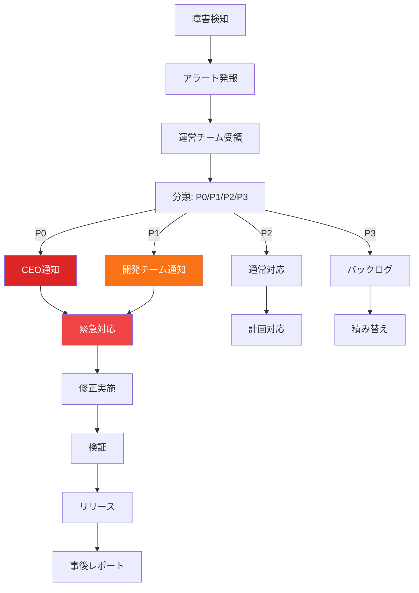
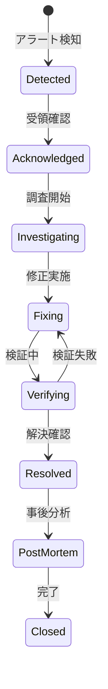
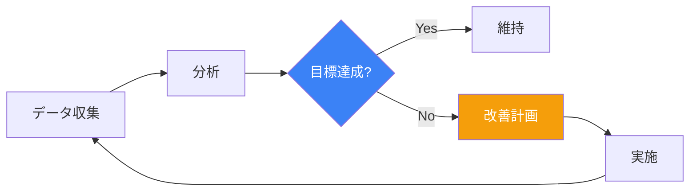

# Mobile Inbox 運用フロー定義書

**作成日**: 2026-03-08
**担当**: Operations Team (Atlas)
**ステータス**: ✅ 完了
**関連仕様**: [Mobile Inbox & Watcher 仕様定義書](../7ef7e61a/docs/plans/2026-03-08-mobile-inbox-watcher-spec.md)

---

## 1. 運用目的

Mobile Inbox機能の安定稼働を維持し、ユーザー（CEO、チームリーダー）に円滑な意思決定体験を提供する。

---

## 2. 日常運用フロー

### 2.1 日次業務

| 時間 | 業務 | 担当 | 確認項目 |
|:-----|:-----|:-----|:---------|
| 09:00 | ダッシュボード確認 | 運営 | 前日アラート、健全性 |
| 10:00 | ログレビュー | 運営 | エラー、警告ログ |
| 12:00 | 昼休憩 | - | - |
| 14:00 | パフォーマンス確認 | 運営 | レスポンス時間、エラー率 |
| 17:00 | 日報作成 | 運営 | 当日サマリー |
| 18:00 | 引継ぎ | 運営 | 未解決課題の共有 |

### 2.2 週次業務

| 曜日 | 業務 | 内容 |
|:-----|:-----|:-----|
| 月曜 | 週次レビュー | 先週のサマリー、今週の予定 |
| 水曜 | キャパシティ確認 | DBサイズ、ログ容量 |
| 金曜 | バックアップ確認 | 週次バックアップの健全性 |

### 2.3 月次業務

| 業務 | 内容 | 担当 |
|:-----|:-----|:-----|
| 監視設定レビュー | 閾値の妥当性確認 | 運営リーダー |
| パフォーマンスレビュー | ボトルネック分析 | 運営+開発 |
| セキュリティチェック | 脆弱性スキャン | 運営 |
| ユーザーフィードバック収集 | 改善点の特定 | 企画+運営 |

---

## 3. 障害管理フロー

### 3.1 障害分類

| 分類 | 定義 | 例 | SLA |
|:-----|:-----|:---|:-----|
| **P0 - Service Down** | Mobile Inbox完全に利用不可 | API応答なし、UI表示不能 | 1時間 |
| **P1 - Major** | 主要機能が利用不可 | アイテム表示不能、通知不来 | 4時間 |
| **P2 - Minor** | 一部機能に支障 | 特定アイテムのみ表示不可 | 24時間 |
| **P3 - Trivial** | 軽微な問題 | 表示崩れ、文言誤り | 次回リリース |

### 3.2 障害対応プロセス



### 3.3 エスカレーションルール

| 経過時間 | アクション | 通知先 |
|:---------|:----------|:-------|
| 0分 | アラート発報 | 運営チーム |
| 15分 | 対応なし | 運営リーダー |
| 30分 | 対応なし（P0/P1） | CEO + 開発リーダー |
| 1時間 | 未解決（P0） | 全員緊急対応 |

---

## 4. インシデント管理

### 4.1 インシデントライフサイクル



### 4.2 インシデントレポート

```markdown
# インシデントレポート

## 基本情報
- **発生日時**: 2026-03-08 14:32 JST
- **検知方法**: アラート W-CRIT-001
- **分類**: P0 - Service Down
- **担当**: Turbo (Ops), Bolt (Dev)

## 概要
Mobile Inbox APIが応答せず、全ユーザーがアクセス不能

## 影響範囲
- 期間: 14:32 - 15:15 (43分間)
- ユーザー: 全CEO、チームリーダー
- 機能: DecisionInbox全機能

## 根本原因
Watcherプロセスがメモリ不足でクラッシュし、自動再起動に失敗

## 対応内容
1. 手動でWatcherプロセス再起動 (14:45)
2. メモリ使用量監視強化 (14:50)
3. メモリ最適化パッチ適用 (翌日)

## 防止策
- メモリ使用量の監視閾値引き下げ (500MB → 400MB)
- 自動再起動ロジックの改善
- 定期的なメモリプロファイリング

## 教訓
- 自動復旧の限界を認識
- メモリ監視の重要性
```

---

## 5. メンテナンス運用

### 5.1 メンテナンス種別

| 種別 | 目的 | 頻度 | 期間 |
|:-----|:-----|:-----|:-----|
| **予防** | 故障予防 | 月1回 | 1-2時間 |
| **修正** | バグ修正 | 随時 | 変動 |
| **改善** | 性能向上 | 四半期1回 | 4-8時間 |
| **緊急** | 緊急対応 | 随時 | 即時 |

### 5.2 メンテナンスウィンドウ

| 時間帯 | 対象 | 通知 |
|:-------|:-----|:-----|
| 深夜 2:00-4:00 | 通常メンテナンス | 1日前 |
| 平日 18:00-19:00 | 軽微修正 | 4時間前 |
| 随時 | 緊急メンテナンス | 即時 |

### 5.3 メンテナンスチェックリスト

#### 事前
- [ ] メンテナンス計画の通知
- [ ] バックアップ取得
- [ ] ロールバック手順確認
- [ ] 影響範囲の特定

#### 実施中
- [ ] 作業ログの記録
- [ ] 健全性チェック
- [ ] ユーザー通知

#### 事後
- [ ] 機能確認テスト
- [ ] パフォーマンス確認
- [ ] メンテナンスレポート作成

---

## 6. ユーザーサポート

### 6.1 サポートチャネル

| チャネル | 用途 | 回答時間 |
|:---------|:-----|:---------|
| Telegram | 緊急報告 | 即時 |
| Email | 一般問い合わせ | 24時間以内 |
| Dashboard | セルフサービス | - |

### 6.2 よくある問い合わせ（FAQ）

| 問い合わせ | 原因 | 対応 |
|:-----------|:-----|:-----|
| アイテムが表示されない | キャッシュ | ブラウザリロード |
| 通知が来ない | 設定無効 | Watcher設定確認 |
| 操作できない | 機能停止 | 障害情報確認 |

### 6.3 コミュニケーションルール

| 状況 | 通知方法 | 内容 |
|:-----|:---------|:-----|
| 計画メンテナンス | 事前通知 | 日時、影響、予定時間 |
| 障害発生 | 即時通知 | 現象、影響、対応予定 |
| 復旧 | 完了通知 | 復旧時間、原因 |
| 機能追加 | リリースノート | 新機能、変更点 |

---

## 7. 品質管理

### 7.1 サービス品質指標（KPI）

| 指標 | 目標 | 測定方法 |
|:-----|:-----|:---------|
| **可用性** | 99.5% | uptime / total_time |
| **レスポンス時間** | P95 < 500ms | APIログ |
| **エラー率** | < 1% | errors / total_requests |
| **通知成功率** | > 95% | delivered / sent |

### 7.2 品質レビュー



---

## 8. ドキュメント管理

### 8.1 運用ドキュメント

| ドキュメント | 更新頻度 | 担当 |
|:-------------|:---------|:-----|
| 本運用フロー定義書 | 四半期 | 運営リーダー |
| 障害対応手順 | 変更時 | 運営 |
| Runbook（手順書） | 変更時 | 運営 |
| インシデントレポート | 事後 | 運営 |

### 8.2 ナレッジベース

| カテゴリ | 内容 |
|:---------|:-----|
| トラブルシューティング | 過去の障害と解決策 |
| よくある質問 | FAQ |
| ベストプラクティス | 推奨運用方法 |
| 用語集 | 専門用語の解説 |

---

## 9. トレーニング

### 9.1 新規運営メンバー研修

| トピック | 時間 |
|:---------|:-----|
| システム概要 | 1時間 |
| 運用フロー | 2時間 |
| 障害対応 | 2時間 |
| ツール使用 | 1時間 |

### 9.2 定期トレーニング

| トピック | 頻度 | 時間 |
|:---------|:-----|:-----|
| 障害対応訓練 | 四半期 | 2時間 |
| 新機能研修 | リリース時 | 1時間 |
| ベストプラクティス共有 | 月次 | 1時間 |

---

## 10. まとめ

本運用フロー定義により、以下が実現できます：

1. **標準化された運用手順**: 日常業務から障害対応まで明確化
2. **迅速な障害対応**: SLAに基づくエスカレーション
3. **継続的改善**: KPIに基づく品質管理
4. **知識の蓄積**: ドキュメント・ナレッジベースの整備

---

**署名**: Operations Team (Atlas)
**日付**: 2026-03-08
