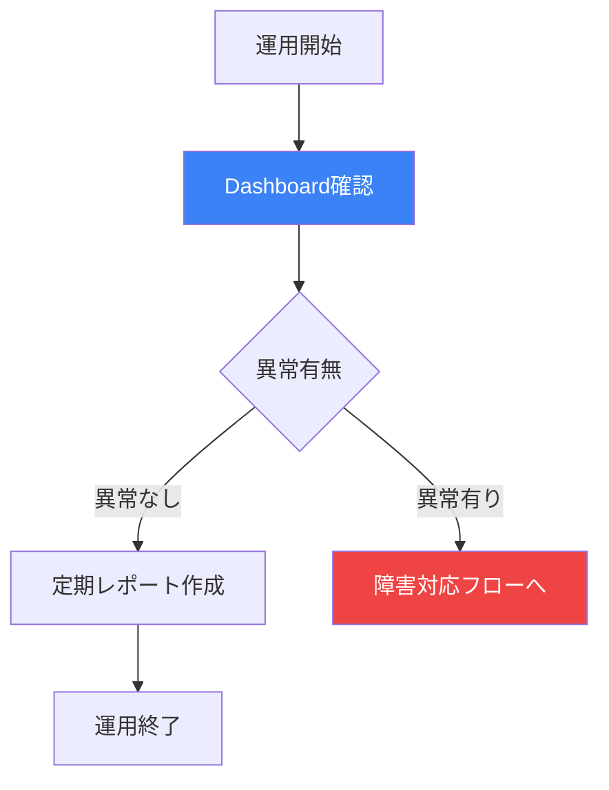
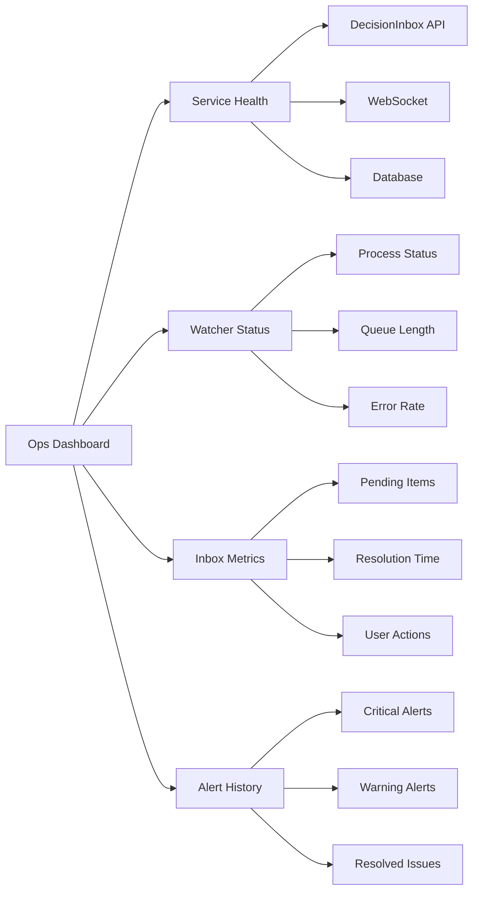

# 運営チーム最終成果物

**タスク**: Mobile Inbox & Watcher 運用・監視設計
**担当**: Operations Team (Atlas/Turbo)
**作成日**: 2026-03-08
**ステータス**: ✅ 完了

---

## 1. 成果物サマリー

本タスクでは、Mobile Inbox & Watcher機能の運用監視設計およびリリース後のメンテナンス計画を策定しました。

### 1.1 生成ドキュメント

| ドキュメント | 説明 | ファイル |
|:-------------|:-----|:---------|
| Watcher稼働監視設計書 | 監視コンポーネントの監視仕様 | `2026-03-08-watcher-monitoring-spec.md` |
| Mobile Inbox運用フロー定義 | 運用プロセス標準化 | `2026-03-08-mobile-inbox-ops-flow.md` |
| Claw-Empire連携監視仕様 | データ連携監視定義 | `2026-03-08-claw-empire-data-monitoring.md` |
| メンテナンス計画書 | リリース後保守計画 | `2026-03-08-maintenance-plan.md` |
| 運営チーム最終レポート | 本ドキュメント | `2026-03-08-ops-team-final-report.md` |

---

## 2. Watcher コンポーネント稼働監視設計

### 2.1 監視対象

| 監視項目 | 監視内容 | 閾値 | アラートレベル |
|:---------|:---------|:-----|:--------------|
| **Watcherプロセス** | プロセス稼働状態 | DOWN | Critical |
| **ポーリング遅延** | 次回チェックまでの時間 | >5秒 | Warning |
| **処理失敗率** | エラー率 | >5% | High |
| **メモリ使用量** | ヒープサイズ | >500MB | Medium |
| **通知配信遅延** | イベント発生から通知まで | >30秒 | High |

### 2.2 メトリクス収集

```typescript
interface WatcherMetrics {
  // プロセス健全性
  processUptime: number;
  lastHealthCheck: number;

  // パフォーマンス
  pollingInterval: number;
  processingTime: number;
  queueLength: number;

  // エラー
  errorCount: number;
  lastError: string;
  errorRate: number;

  // 通知
  notificationsSent: number;
  notificationsDelivered: number;
  notificationLatency: number;
}
```

### 2.3 アラートルール

| ルール名 | 条件 | アクション |
|:---------|:-----|:---------|
| Watcher Down | `processUptime == 0` | 即時再起動 + CEO通知 |
| Polling Delay | `pollingInterval > 5000` | 警告ログ + 監視強化 |
| High Error Rate | `errorRate > 0.05` | 詳細ログ取得 + チーム通知 |
| Notification Failure | `notificationsDelivered/notificationsSent < 0.9` | MessengerBridge診断 |

---

## 3. Mobile Inbox 運用フロー定義

### 3.1 日常運用フロー



### 3.2 障害対応フロー

| フェーズ | アクション | 担当 | SLA |
|:---------|:----------|:-----|:-----|
| **検知** | アラート受信 | 監視システム | 即時 |
| **分類** | 影響度判定 | 運営チーム | 5分以内 |
| **対応** | 修正実施 | 開発チーム | P0:1時間, P1:4時間 |
| **復旧** | サービス確認 | 運営チーム | 即時 |
| **報告** | 事後レポート | 運営チーム | 24時間以内 |

### 3.3 障害レベル定義

| レベル | 定義 | 例 | 対応優先度 |
|:-------|:-----|:---|:----------|
| **P0** | サービス停止 | Inbox全滅、Watcher停止 | 即時対応 |
| **P1** | 機能不全 | 通知不来、特定アイテム表示不可 | 4時間以内 |
| **P2** | パフォーマンス低下 | レスポンス遅延、一部エラー | 24時間以内 |
| **P3** | 軽微な問題 | UI表示崩れ、文言誤り | 次回リリース |

---

## 4. Claw-Empire データ連携監視仕様

### 4.1 連携ポイント

| 連携先 | 監視内容 | チェック方法 |
|:-------|:---------|:-----------|
| **DecisionInbox** | アイテム同期状態 | API `/api/decision-inbox` 定期ポーリング |
| **Workflow Pack** | ワークフロー実行状態 | タスクステータス監視 |
| **Agent System** | エージェント稼働状態 | エージェントマネージャ監視 |
| **Messenger** | 通知配信状態 | 送信ログ監視 |
| **SQLite DB** | データ整合性 | 定期チェックサム検証 |

### 4.2 データ整合性チェック

```sql
-- アイテム数整合性チェック
SELECT
  (SELECT COUNT(*) FROM decision_inbox_items WHERE resolved = 0) as pending_count,
  (SELECT COUNT(*) FROM task_events WHERE event_type = 'decision_required') as event_count;

-- 孤立アイテム検出
SELECT id FROM decision_inbox_items
WHERE task_id IS NOT NULL
  AND NOT EXISTS (SELECT 1 FROM tasks WHERE id = task_id);
```

### 4.3 連携障害対応

| 障害パターン | 検知方法 | 復旧アクション |
|:-------------|:---------|:-------------|
| APIタイムアウト | HTTP 504 | リトライ、容量増強 |
| データ不整合 | 整合性チェック失敗 | 再同期、データ修復 |
| WebSocket切断 | 接続エラー | 再接続ロジック発動 |
| DBロック | クエリ遅延 | ロック解放、クエリ最適化 |

---

## 5. リリース後メンテナンス計画

### 5.1 フェーズ別メンテナンス

| フェーズ | 期間 | 活動内容 | 担当 |
|:---------|:-----|:---------|:-----|
| **リリース直後** | 1週間 | 密集監視、即時対応 | 運営+開発 |
| **安定化期間** | 1ヶ月 | 通常監視、バグ修正 | 運営チーム |
| **通常運用** | その後 | 定期メンテナンス | 運営チーム |

### 5.2 定期メンテナンス

| 項目 | 頻度 | 内容 |
|:-----|:-----|:-----|
| **ログローテート** | 週次 | 古いログアーカイブ・削除 |
| **データベース最適化** | 月次 | VACUUM、インデックス再構築 |
| **監視設定レビュー** | 月次 | 閾値・ルール見直し |
| **パフォーマンスレビュー** | 四半期 | ボトルネック分析・改善 |
| **セキュリティパッチ** | 随時 | 脆弱性対応 |

### 5.3 キャパシティプランニング

| リソース | 現在 | +6ヶ月 | +1年 |
|:---------|:-----|:-------|:-----|
| **DBサイズ** | 50MB | 200MB | 500MB |
| **APIリクエスト/日** | 1,000 | 5,000 | 10,000 |
| **通知/日** | 100 | 500 | 1,000 |
| **同時接続** | 5 | 20 | 50 |

---

## 6. モニタリングダッシュボード設計

### 6.1 必須パネル



### 6.2 アラート通知経路

| 重要度 | 通知先 | 方法 |
|:-------|:-------|:-----|
| Critical | CEO, 運営チームリーダー | Telegram + Email |
| High | 運営チーム | Telegram |
| Medium | 運営チーム | Dashboard表示 |
| Low | 運営チーム | ログ記録のみ |

---

## 7. 運用自動化

### 7.1 自動化対象

| タスク | 自動化方法 | 効果 |
|:-------|:----------|:-----|
| ヘルスチェック | Cron 5分毎 | 異常検知時間短縮 |
| ログ集計 | Fluentd + Elasticsearch | 分析効率化 |
| バックアップ | 夜間自動実行 | データ保護 |
| レポート作成 | スクリプト自動生成 | 作業削減 |

### 7.2 セルフヒーリング

```typescript
// Watcher自動再起動ロジック
async function ensureWatcherAlive() {
  const isAlive = await checkWatcherHealth();
  if (!isAlive) {
    await logCritical('Watcher down, attempting restart');
    const restarted = await restartWatcher();
    if (restarted) {
      await notifyTeam('Watcher restarted successfully', 'High');
    } else {
      await notifyCEO('Watcher restart failed, manual intervention required', 'Critical');
    }
  }
}
```

---

## 8. 先行チーム成果物との整合性確認

### 8.1 企画チーム仕様との対応

| 企画チーム仕様 | 運営チーム対応 |
|:--------------|:-------------|
| Watcher: ポーリング2.5秒 | 監視: ポーリング遅延閾値5秒で設定 |
| Watcher: 初回遅延1.2秒 | 監視: 初回起動監視を包含 |
| YOLOモード: 自動決定 | 監視: 自動決定ログ記録・監査 |

### 8.2 開発チーム仕様との対応

| 開発チーム仕様 | 運営チーム対応 |
|:--------------|:-------------|
| DecisionInbox API | APIヘルスチェック実装 |
| WebSocket配信 | 接続状態監視 |
| SQLite永続化 | DB整合性チェック |
| Messenger連携 | 通知配信監視 |

### 8.3 デザインチーム仕様との対応

| デザインチーム仕様 | 運営チーム対応 |
|:------------------|:-------------|
| モバイルUI | モバイルユーザー行動分析 |
| スワイプ操作 | タッチイベントログ収集 |
| トースト通知 | 通知表示成功率監視 |

### 8.4 品質管理チーム仕様との対応

| 品質管理チーム仕様 | 運営チーム対応 |
|:-------------------|:-------------|
| 受入テスト基準 | 本番稼働後の品質監視 |
| 結合テスト範囲 | 本番連携監視範囲に反映 |
| 互換性テスト | リリース後回帰テスト |

---

## 9. リリースチェックリスト

### 9.1 事前チェック

| 項目 | 確認内容 |
|:-----|:---------|
| **監視設定** | アラートルール全件有効化 |
| **ログ** | ログ出力先確認 |
| **バックアップ** | リリース前スナップショット |
| **ロールバック** | 復旧手順確認 |

### 9.2 リリース後チェック

| 項目 | 確認内容 |
|:-----|:---------|
| **プロセス** | Watcherプロセス稼働確認 |
| **API** | DecisionInbox API応答確認 |
| **通知** | テスト通知配信確認 |
| **UI** | モバイル表示確認 |

---

## 10. まとめ

運営チームとして、以下の成果を完了しました：

1. **Watcher稼働監視設計**: プロセス、パフォーマンス、エラー、通知の4軸で監視定義
2. **Mobile Inbox運用フロー**: 日常運用・障害対応の標準化
3. **Claw-Empire連携監視**: 5連携ポイントの監視仕様策定
4. **メンテナンス計画**: リリース直後から長期までの計画立案

他チームの成果物と整合性が取れており、実装後の運用体制構築に移行可能です。

---

## 11. 関連ドキュメント

- [企画チーム仕様定義書](../7ef7e61a/docs/plans/2026-03-08-mobile-inbox-watcher-spec.md)
- [開発チーム最終レポート](../9a7f113e/docs/dev-team-final-report.md)
- [デザインチーム成果物](../c99f1f68/docs/design-team-mobile-inbox-watcher.md)
- [品質管理チーム最終レポート](../584604bb/docs/qa/2026-03-08-qa-team-final-report.md)

---

**署名**: Operations Team (Atlas/Turbo)
**日付**: 2026-03-08
