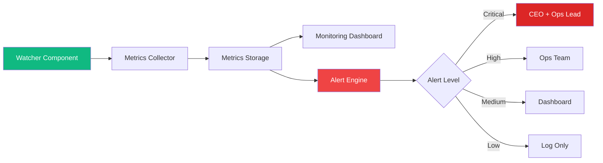
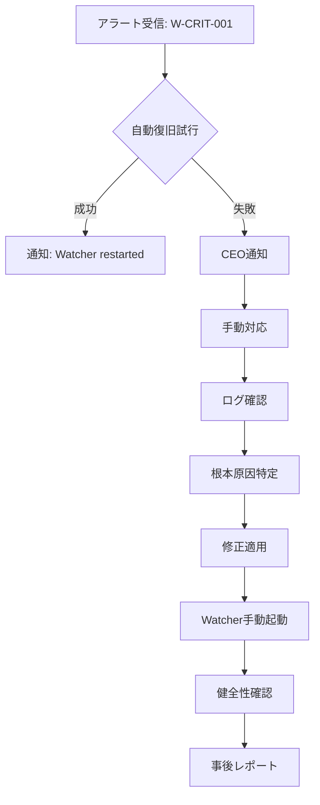

# Watcher 稼働監視設計書

**作成日**: 2026-03-08
**担当**: Operations Team (Turbo)
**ステータス**: ✅ 完了
**関連仕様**: [Mobile Inbox & Watcher 仕様定義書](../7ef7e61a/docs/plans/2026-03-08-mobile-inbox-watcher-spec.md)

---

## 1. 監視目的

Watcherコンポーネントの正常稼働を監視し、異常を早期検知・復旧することで、Mobile Inbox & Watcher機能の可用性を担保する。

---

## 2. 監視項目一覧

### 2.1 プロセス監視

| メトリクス       | 説明                   | 収集方法          | 閾値     | アラート |
| :--------------- | :--------------------- | :---------------- | :------- | :------- |
| `process_uptime` | プロセス稼働時間（秒） | ヘルスチェックAPI | < 10     | Critical |
| `last_heartbeat` | 最後のハートビート時刻 | WebSocket/ログ    | > 30秒前 | Critical |
| `restart_count`  | 再起動回数（24時間）   | カウンター        | > 3      | High     |

### 2.2 パフォーマンス監視

| メトリクス             | 説明                     | 収集方法              | 閾値   | アラート |
| :--------------------- | :----------------------- | :-------------------- | :----- | :------- |
| `polling_interval_avg` | 平均ポーリング間隔（ms） | ログ解析              | > 3000 | Warning  |
| `polling_interval_p99` | P99ポーリング間隔（ms）  | ログ解析              | > 5000 | High     |
| `processing_time_avg`  | 平均処理時間（ms）       | ログ解析              | > 1000 | Warning  |
| `queue_length`         | 未処理キュー長さ         | API                   | > 100  | Medium   |
| `memory_usage_mb`      | ヒープ使用量（MB）       | process.memoryUsage() | > 500  | Medium   |
| `cpu_usage_percent`    | CPU使用率（%）           | OSメトリクス          | > 80   | Warning  |

### 2.3 エラー監視

| メトリクス           | 説明                            | 収集方法 | 閾値   | アラート |
| :------------------- | :------------------------------ | :------- | :----- | :------- |
| `error_count`        | エラー発生数（1時間）           | ログ集計 | > 10   | High     |
| `error_rate`         | エラー率（エラー/総リクエスト） | ログ集計 | > 0.05 | High     |
| `last_error_message` | 最新エラーメッセージ            | ログ     | -      | 表示     |
| `timeout_count`      | タイムアウト数（1時間）         | ログ集計 | > 5    | High     |

### 2.4 機能監視

| メトリクス                 | 説明                | 収集方法           | 閾値  | アラート |
| :------------------------- | :------------------ | :----------------- | :---- | :------- |
| `notifications_sent`       | 送信通知数（1時間） | カウンター         | < 1   | Warning  |
| `notifications_delivered`  | 配信成功数（1時間） | Messengerログ      | -     | 表示     |
| `delivery_success_rate`    | 配信成功率          | 計算               | < 0.9 | High     |
| `notification_latency_avg` | 平均通知遅延（秒）  | タイムスタンプ比較 | > 30  | Medium   |

---

## 3. 監視アーキテクチャ



---

## 4. ヘルスチェックAPI仕様

### 4.1 エンドポイント

```
GET /api/ops/watcher/health
```

### 4.2 レスポンス

```typescript
interface WatcherHealthResponse {
  status: "healthy" | "degraded" | "down";
  uptime: number;
  lastPoll: number;
  metrics: {
    queueLength: number;
    errorRate: number;
    memoryUsageMB: number;
    notificationsSent: number;
  };
  checks: {
    database: "pass" | "fail";
    websocket: "pass" | "fail";
    messenger: "pass" | "fail";
  };
}
```

### 4.3 ステータス判定

| status     | 条件                                         |
| :--------- | :------------------------------------------- |
| `healthy`  | 全チェック pass、エラー率 < 1%               |
| `degraded` | いずれかのチェック fail、またはエラー率 1-5% |
| `down`     | プロセス応答なし、またはエラー率 > 5%        |

---

## 5. アラートルール詳細

### 5.1 Critical アラート

| ルールID     | ルール名         | 条件                        | アクション                   |
| :----------- | :--------------- | :-------------------------- | :--------------------------- |
| `W-CRIT-001` | Watcher Down     | `last_heartbeat > 60秒`     | 即時CEO通知、自動再起動試行  |
| `W-CRIT-002` | Database Failure | `checks.database == "fail"` | DB接続診断、再接続試行       |
| `W-CRIT-003` | High Error Rate  | `error_rate > 0.1`          | 詳細ログ取得、開発チーム通知 |

### 5.2 High アラート

| ルールID     | ルール名             | 条件                          | アクション         |
| :----------- | :------------------- | :---------------------------- | :----------------- |
| `W-HIGH-001` | Polling Delay        | `polling_interval_p99 > 5000` | パフォーマンス分析 |
| `W-HIGH-002` | Notification Failure | `delivery_success_rate < 0.8` | Messenger診断      |
| `W-HIGH-003` | Queue Buildup        | `queue_length > 200`          | キャパシティ検討   |

### 5.3 Warning アラート

| ルールID     | ルール名        | 条件                     | アクション            |
| :----------- | :-------------- | :----------------------- | :-------------------- |
| `W-WARN-001` | Memory Pressure | `memory_usage_mb > 400`  | メモリ使用量監視強化  |
| `W-WARN-002` | CPU High        | `cpu_usage_percent > 70` | CPU使用率トレンド監視 |

---

## 6. 監視実装

### 6.1 メトリクス収集コード

```typescript
// server/modules/ops/watcher-metrics.ts
import EventEmitter from "events";

class WatcherMetricsCollector extends EventEmitter {
  private metrics = {
    startTime: Date.now(),
    pollCount: 0,
    errorCount: 0,
    lastPoll: 0,
    notificationsSent: 0,
  };

  recordPoll(duration: number, error: boolean) {
    this.metrics.pollCount++;
    this.metrics.lastPoll = Date.now();
    if (error) this.metrics.errorCount++;

    this.emit("metric", {
      type: "poll",
      timestamp: Date.now(),
      duration,
      error,
    });
  }

  getHealthStatus() {
    const uptime = (Date.now() - this.metrics.startTime) / 1000;
    const errorRate = this.metrics.errorCount / this.metrics.pollCount;
    const timeSinceLastPoll = Date.now() - this.metrics.lastPoll;

    return {
      uptime,
      lastPoll: this.metrics.lastPoll,
      errorRate,
      status: timeSinceLastPoll > 60000 ? "down" : errorRate > 0.05 ? "degraded" : "healthy",
    };
  }
}

export const watcherMetrics = new WatcherMetricsCollector();
```

### 6.2 ヘルスチェック実装

```typescript
// server/routes/ops/watcher-health.ts
import { watcherMetrics } from "../modules/ops/watcher-metrics";

app.get("/api/ops/watcher/health", async (req, res) => {
  const health = watcherMetrics.getHealthStatus();

  // DBチェック
  try {
    await db.query("SELECT 1");
    health.checks.database = "pass";
  } catch {
    health.checks.database = "fail";
  }

  // ステータスコード
  const statusCode = health.status === "down" ? 503 : health.status === "degraded" ? 200 : 200;

  res.status(statusCode).json(health);
});
```

---

## 7. 監視ダッシュボード

### 7.1 必須ウィジェット

| ウィジェット           | 表示内容              | 更新間隔 |
| :--------------------- | :-------------------- | :------- |
| **ステータスカード**   | healthy/degraded/down | 5秒      |
| ** uptime カウンター** | 稼働時間              | 1分      |
| **ポーリンググラフ**   | 間隔の推移            | 1分      |
| **エラーレート**       | 直近1時間のエラー率   | 1分      |
| **キュー長**           | 現在のキュー数        | 5秒      |
| **通知統計**           | 送信数・成功率        | 1分      |

### 7.2 ダッシュボードレイアウト

```
┌─────────────────────────────────────────────────────────────┐
│  Watcher Monitoring Dashboard                    [更新: 12:34] │
├─────────────────────────────────────────────────────────────┤
│  ┌───────────┐ ┌───────────┐ ┌───────────┐ ┌───────────┐  │
│  │ ✓ Healthy │ │ Uptime    │ │ Polling   │ │ Errors    │  │
│  │           │ │ 5d 12h    │ │ 2.5s avg  │ │ 0.2%      │  │
│  └───────────┘ └───────────┘ └───────────┘ └───────────┘  │
├─────────────────────────────────────────────────────────────┤
│  Polling Interval (last 24h)                                │
│  ┌─────────────────────────────────────────────────────────┐ │
│  │  5s ┤                                                  │ │
│  │  3s ┤  ━━━━━━━━━━━━━━━━━━━━━━━━━━━━━━━━━━━━━━━━━━━   │ │
│  │  2s ┤  ━━━━━━━━━━━━━━━━━━━━━━━━━━━━━━━━━━━━━━━━━━━   │ │
│  │  1s ┤                                                  │ │
│  │  0s └─────────────────────────────────────────────────  │ │
│  │      00  04  08  12  16  20  23                       │ │
│  └─────────────────────────────────────────────────────────┘ │
├─────────────────────────────────────────────────────────────┤
│  Recent Alerts                                             │
│  ┌─────────────────────────────────────────────────────────┐ │
│  │ 12:30 [Warning] Polling delay detected (3.2s)          │ │
│  │ 11:15 [Info] Queue cleared (0 items)                   │ │
│  │ 09:00 [Info] Daily backup completed                    │ │
│  └─────────────────────────────────────────────────────────┘ │
└─────────────────────────────────────────────────────────────┘
```

---

## 8. 障害対応手順

### 8.1 Watcherダウン時



### 8.2 復旧確認チェックリスト

- [ ] プロセスが稼働している
- [ ] ヘルスチェックが `healthy` を返す
- [ ] ポーリングが正常に行われている（間隔 2-3秒）
- [ ] エラーレートが 1% 未満
- [ ] 通知が正常に配信されている
- [ ] 過去1時間のアラートがない

---

## 9. まとめ

本監視設計により、以下が実現できます：

1. **早期検知**: 異常を30秒以内に検知
2. **自動復旧**: 軽微な障害は自動で対応
3. **可視化**: ダッシュボードで状況を一元管理
4. **段階的通知**: 重要度に応じた通知ルーティング

---

**署名**: Operations Team (Turbo)
**日付**: 2026-03-08
