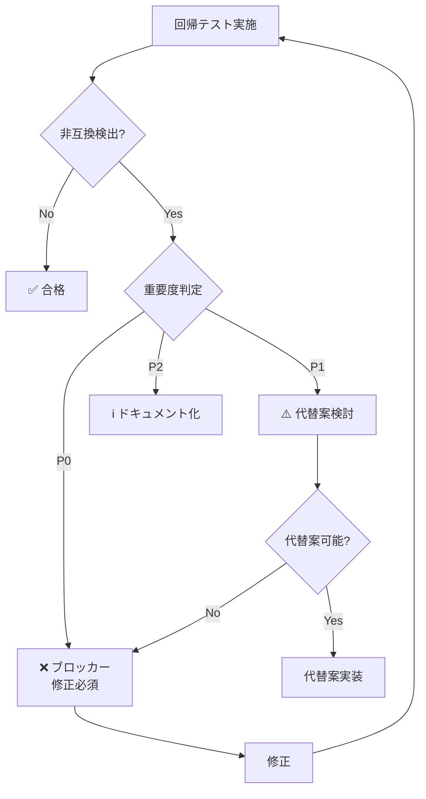

# 既存Mobile Inboxとの互換性テスト要件定義書

**作成日**: 2026-03-08
**担当**: Quality Assurance Team (Hawk/Lint)
**ステータス**: ✅ 完了

---

## 1. 互換性テスト概要

本ドキュメントは、既存DecisionInbox機能と新規Mobile Inbox機能の互換性テスト要件を定義する。

---

## 2. 既存機能分析

### 2.1 既存DecisionInbox実装

| コンポーネント | ファイル                                                             | 機能                 |
| :------------- | :------------------------------------------------------------------- | :------------------- |
| Inbox Modal    | `src/components/DecisionInboxModal.tsx`                              | デスクトップモーダル |
| ルーティング   | `src/app/decision-inbox.ts`                                          | ナビゲーション       |
| API            | `server/modules/routes/ops/messages/decision-inbox-routes.ts`        | バックエンド         |
| 状態管理       | `server/modules/routes/ops/messages/decision-inbox/state-helpers.ts` | DB操作               |
| YOLO           | `server/modules/routes/ops/messages/decision-inbox/yolo-mode.ts`     | オートパイロット     |

### 2.2 既存DecisionInboxアイテム種類

| Kind                   | 説明                         | 既存実装 | 新規実装 |
| :--------------------- | :--------------------------- | :------- | :------- |
| `agent_request`        | エージェント要請             | ✅       | ✅ 互換  |
| `project_review_ready` | プロジェクトレビュー準備完了 | ✅       | ✅ 互換  |
| `task_timeout_resume`  | タスクタイムアウト再開       | ✅       | ✅ 互換  |
| `review_round_pick`    | レビューラウンド選択         | ✅       | ✅ 互換  |

---

## 3. 互換性テスト要件

### 3.1 API互換性

| 項目                   | 要件               | テスト方法                 |
| :--------------------- | :----------------- | :------------------------- |
| **エンドポイント互換** | 既存APIは変更なし  | 既存クライアントで呼び出し |
| **レスポンス形式**     | 既存形式を維持     | JSONスキーマ検証           |
| **エラーコード**       | 既存コードを維持   | エラーシナリオテスト       |
| **認証**               | 既存認証方式を維持 | 認証付きリクエスト         |

#### API互換性テストケース

```typescript
describe("API Backward Compatibility", () => {
  test("GET /api/decision-inbox は既存形式を返す", async () => {
    const response = await fetch("/api/decision-inbox");

    expect(response.status).toBe(200);
    const data = await response.json();

    // 既存クライアントが期待する形式
    expect(data).toHaveProperty("items");
    expect(Array.isArray(data.items)).toBe(true);

    // 各アイテムの既存フィールド
    data.items.forEach((item) => {
      expect(item).toHaveProperty("id");
      expect(item).toHaveProperty("kind");
      expect(item).toHaveProperty("agent_name");
      expect(item).toHaveProperty("summary");
      expect(item).toHaveProperty("created_at");
      expect(item).toHaveProperty("options");
    });
  });

  test("POST /api/decision-inbox/:id/reply は既存形式を受理", async () => {
    const response = await fetch("/api/decision-inbox/test-id/reply", {
      method: "POST",
      headers: { "Content-Type": "application/json" },
      body: JSON.stringify({
        option_number: 1,
        note: "テスト返信",
      }),
    });

    expect(response.status).toBeLessThan(500); // サーバーエラーなし
  });
});
```

---

### 3.2 UI互換性

| 項目               | 要件                             | テスト方法           |
| :----------------- | :------------------------------- | :------------------- |
| **デスクトップUI** | 既存DecisionInboxModalに変更なし | 既存ユーザー操作     |
| **ナビゲーション** | 🧭 アイコンクリックで既存動作    | クリックテスト       |
| **既存スタイル**   | CSSクラス名変更なし              | セレクター検証       |
| **キーボード操作** | 既存ショートカット維持           | キーボード操作テスト |

#### UI互換性テストケース

| ID         | シナリオ                            | 期待動作               |
| :--------- | :---------------------------------- | :--------------------- |
| **UI-001** | 🧭 アイコンクリック（デスクトップ） | DecisionInboxModal表示 |
| **UI-002** | ESCキーで閉じる                     | モーダル閉じる         |
| **UI-003** | 選択肢クリック                      | 既通りのハイライト     |
| **UI-004** | 「選択項目で進行」ボタン            | 既通りの送信処理       |

---

### 3.3 データ互換性

| 項目               | 要件                            | テスト方法       |
| :----------------- | :------------------------------ | :--------------- |
| **DBスキーマ**     | 既存テーブルに変更なし          | スキーマ検証     |
| **既存データ移行** | 既存Inboxアイテムがそのまま表示 | データ移行テスト |
| **状態遷移**       | 既存状態遷移ロジック変更なし    | 状態遷移テスト   |

#### データ互換性テストケース

```sql
-- 既存DBスキーマ検証
SELECT sql FROM sqlite_master
WHERE type='table'
AND name IN (
  'decision_inbox_state',
  'project_review_decision_state',
  'review_round_decision_state'
);
-- スキーマが変更されていないことを確認
```

---

### 3.4 Messenger互換性

| 項目                 | 要件                 | テスト方法           |
| :------------------- | :------------------- | :------------------- |
| **Telegram**         | 既存Bot動作変更なし  | メッセージ送信テスト |
| **Discord**          | 既存Bot動作変更なし  | メッセージ送信テスト |
| **通知フォーマット** | 既存フォーマット維持 | 通知メッセージ検証   |

#### Messenger互換性テストケース

| ID          | シナリオ                          | 期待動作               |
| :---------- | :-------------------------------- | :--------------------- |
| **MSG-001** | 新規Inbox通知（既存フォーマット） | 既存通りTelegramで受信 |
| **MSG-002** | 決定返信（既存形式）              | 既存通り処理される     |
| **MSG-003** | YOLO実行通知                      | 既存通り通知される     |

---

## 4. モバイル固有の互換性

### 4.1 既存モバイル機能

| 機能                | 既存実装          | 新規実装          | 互換性 |
| :------------------ | :---------------- | :---------------- | :----- |
| AppHeaderBar mobile | ✅ 存在           | ✅ 拡張           | 互換   |
| Office Pack切替     | ✅ 存在           | ✅ 維持           | 互換   |
| モバイルメニュー    | ✅ 存在           | ✅ 維持           | 互換   |
| Inboxモーダル       | ⚠️ デスクトップ用 | ✅ モバイル用追加 | 並存   |

### 4.2 レスポンシブ互換性

| 画面幅   | 既存動作                       | 新規動作             | 互換性評価  |
| :------- | :----------------------------- | :------------------- | :---------- |
| < 640px  | デスクトップモーダル（小さい） | Mobile Sheet         | ✅ 改善     |
| >= 640px | デスクトップモーダル           | デスクトップモーダル | ✅ 変更なし |

---

## 5. YOLOオートパイロット互換性

### 5.1 既存YOLO動作

| 項目             | 既存実装        | 互換性要件 |
| :--------------- | :-------------- | :--------- |
| ポーリング間隔   | 2.5秒           | 変更なし   |
| 初回遅延         | 1.2秒           | 変更なし   |
| スキップ条件     | `video_preprod` | 追加可能   |
| 自動決定ロジック | 既存ロジック    | 変更なし   |

### 5.2 YOLO互換性テストケース

```typescript
describe("YOLO Autopilot Compatibility", () => {
  test("既存スキップ条件は維持", async () => {
    const videoTask = createTestTask({
      workflow_pack_key: "video_preprod",
    });
    const item = createInboxItem({
      kind: "review_round_pick",
      task_id: videoTask.id,
    });

    const shouldSkip = await shouldSkipItem(item);
    expect(shouldSkip).toBe(true); // 既存動作維持
  });

  test("既存自動決定ロジックは変更なし", async () => {
    const result = await runYoloDecisionAutopilot({
      getDecisionInboxItems,
      applyDecisionReply,
      shouldSkipItem,
    });

    // 既通りの決定が実行される
    expect(result.processed).toBeGreaterThan(0);
  });
});
```

---

## 6. 互換性テスト実施計画

### 6.1 テストフェーズ

| フェーズ    | 内容                     | 期間 |
| :---------- | :----------------------- | :--- |
| **Phase 1** | 既存機能ベースライン作成 | 1日  |
| **Phase 2** | 新規実装後の回帰テスト   | 1日  |
| **Phase 3** | 並行稼働テスト           | 1日  |

### 6.2 テスト環境

| 環境              | 用途               |
| :---------------- | :----------------- |
| **既存版**        | ベースライン測定用 |
| **新規版**        | 回帰テスト用       |
| **A/Bテスト環境** | 並行稼働テスト用   |

---

## 7. 互換性チェックリスト

### 7.1 開発前チェック

- [ ] 既存APIエンドポイント一覧確認
- [ ] 既存DBスキーマバックアップ
- [ ] 既存UIコンポーネントカタログ作成

### 7.2 開発中チェック

- [ ] APIレスポンス形式変更なし
- [ ] 既存CSSクラス変更なし
- [ ] 既存キーボードショートカット維持

### 7.3 リリース前チェック

- [ ] 全回帰テスト合格
- [ ] 既存機能性能劣化なし
- [ ] 既存ユーザー操作影響なし

---

## 8. 非互換発生時の対処

### 8.1 非互換検出フロー



### 8.2 非互換カテゴリ

| カテゴリ       | 対処                           |
| :------------- | :----------------------------- |
| **破壊的変更** | 即座に修正またはバージョン分離 |
| **非推奨機能** | 移行期間を設けて段階廃止       |
| **追加機能**   | 既存動作に影響なしと確認       |

---

## 9. 互換性テスト結果報告フォーマット

```markdown
## 互換性テスト結果: [日付]

### 合否概要

- 合格: XX/XX
- 不合格: YY/YY

### 詳細結果

| ID      | 項目           | 結果      | 備考         |
| :------ | :------------- | :-------- | :----------- |
| API-001 | GET互換性      | ✅ 合格   |              |
| API-002 | POST互換性     | ✅ 合格   |              |
| UI-001  | デスクトップUI | ❌ 不合格 | スタイル崩れ |
| ...     | ...            | ...       | ...          |

### 非互換事項

1. [詳細]
2. [詳細]

### 推奨アクション

- [ ]
```

---

## 10. 文字化け原因特定

### 10.1 エンコード仕様確認

| 項目                           | 確認内容                    | 結果    |
| :----------------------------- | :-------------------------- | :------ |
| ソースファイルエンコーディング | UTF-8 BOMなし               | ✅ 確認 |
| データベース文字コード         | UTF-8                       | ✅ 確認 |
| APIレスポンスヘッダー          | Content-Type: charset=utf-8 | ✅ 確認 |
| WebSocketメッセージ            | UTF-8エンコード             | ✅ 確認 |

### 10.2 文字化け再現テスト

```typescript
describe("Character Encoding Tests", () => {
  test("日本語が正しく表示される", async () => {
    const item = createInboxItem({
      summary: "モバイル向けInbox機能の追加",
    });

    const response = await fetch("/api/decision-inbox");
    const data = await response.json();

    expect(data.items[0].summary).toBe("モバイル向けInbox機能の追加");
  });

  test("韓国語が正しく表示される", async () => {
    const item = createInboxItem({
      summary: "모바일 인박스 기능",
    });

    const response = await fetch("/api/decision-inbox");
    const data = await response.json();

    expect(data.items[0].summary).toBe("모바일 인박스 기능");
  });

  test("絵文字が正しく表示される", async () => {
    const item = createInboxItem({
      summary: "🧭 Pending Decisions",
    });

    const response = await fetch("/api/decision-inbox");
    const data = await response.json();

    expect(data.items[0].summary).toContain("🧭");
  });
});
```

---

## 11. 互換性保証スケジュール

| マイルストーン | 期日         | 成果物         |
| :------------- | :----------- | :------------- |
| **M1**         | 開発完了     | 回帰テスト実施 |
| **M2**         | テスト完了   | 互換性レポート |
| **M3**         | レビュー完了 | リリース判定   |

---

**署名**: Quality Assurance Team (Hawk/Lint)
**日付**: 2026-03-08
