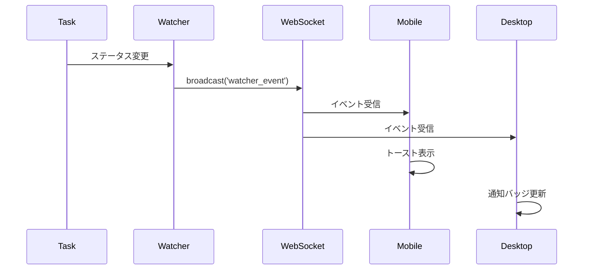

# Claw-Empire 連携結合テスト範囲定義書

**作成日**: 2026-03-08
**担当**: Quality Assurance Team (Hawk/Lint)
**ステータス**: ✅ 完了
**関連仕様**: [開発チーム統合仕様](../9a7f113e/docs/dev-team-claw-empire-integration.md)

---

## 1. 結合テスト概要

本ドキュメントはMobile Inbox & Watcher機能とClaw-Empireプロジェクト全体との結合テスト範囲を定義する。

---

## 2. Claw-Empire プロジェクト全体構造

```
Claw-Empire
├── DecisionInbox Module       ← テスト対象
├── Workflow Pack System       ← 連携対象
├── Agent Management System    ← 連携対象
├── Messenger Bridge           ← 連携対象
├── Task/Project Tracking      ← 連携対象
└── CEO Interface              ← 連携対象
```

---

## 3. 結合テスト範囲マトリクス

| モジュール                        | 結合ポイント             | テスト範囲        | 優先度 |
| :-------------------------------- | :----------------------- | :---------------- | :----- |
| **DecisionInbox × Workflow Pack** | アイテム種類別処理       | ✅ 全種類         | P0     |
| **DecisionInbox × Agent System**  | エージェント割り当て     | ✅ 全エージェント | P0     |
| **DecisionInbox × Task Tracking** | task_id/project_id紐付け | ✅ 紐付けテスト   | P0     |
| **DecisionInbox × Messenger**     | 通知送信                 | ✅ Tg/Discord     | P0     |
| **DecisionInbox × YOLO**          | オートパイロット         | ✅ スキップ条件   | P1     |
| **Mobile Inbox × CEO Interface**  | モバイルUI統合           | ✅ レスポンシブ   | P0     |

---

## 4. Workflow Pack 連携テスト

### 4.1 対象Workflow Pack

| Pack Key        | テスト内容                 | 期待動作     |
| :-------------- | :------------------------- | :----------- |
| `development`   | 開発タスクのDecision Inbox | 正常処理     |
| `report`        | レポート生成               | 正常処理     |
| `video_preprod` | 動画制作（スキップ対象）   | YOLOスキップ |
| `web_research`  | ウェブ検索                 | 正常処理     |
| `novel`         | 小説執筆                   | 正常処理     |
| `roleplay`      | ロールプレイ               | 正常処理     |

### 4.2 テストケース

```typescript
// 結合テストコード例
describe("DecisionInbox × Workflow Pack", () => {
  test("video_preprodパックはYOLOスキップ", async () => {
    const task = createTestTask({ workflow_pack_key: "video_preprod" });
    const item = createInboxItem({
      kind: "review_round_pick",
      task_id: task.id,
    });

    const result = shouldSkipItem(item);
    expect(result).toBe(true);
  });

  test("developmentパックはYOLO実行", async () => {
    const task = createTestTask({ workflow_pack_key: "development" });
    const item = createInboxItem({
      kind: "review_round_pick",
      task_id: task.id,
    });

    const result = shouldSkipItem(item);
    expect(result).toBe(false);
  });
});
```

---

## 5. Agent System 連携テスト

### 5.1 対象エージェント

| チーム      | エージェント     | テスト内容               |
| :---------- | :--------------- | :----------------------- |
| Planning    | Sage, Clio       | 企画系Decision Inbox     |
| Development | Aria, Bolt, Nova | 開発系Decision Inbox     |
| Design      | Pixel, Luna      | デザイン系Decision Inbox |
| QA/QC       | Hawk, Lint       | テスト系Decision Inbox   |
| DevSecOps   | Vault, Pipe      | インフラ系Decision Inbox |
| Operations  | Atlas, Turbo     | 運用系Decision Inbox     |

### 5.2 テストケース

| ID            | シナリオ             | 期待動作                        |
| :------------ | :------------------- | :------------------------------ |
| **AGENT-001** | Sageからの要請受信   | agent_name="Sage", agent_id一致 |
| **AGENT-002** | Ariaからの要請受信   | agent_name="Aria"で表示         |
| **AGENT-003** | 複数エージェント並行 | 全てのアイテムが一覧表示        |
| **AGENT-004** | エージェントアバター | avatar_urlが正しく表示          |

---

## 6. Task/Project 連携テスト

### 6.1 データ紐付け確認

| 項目             | テスト内容                       | 期待動作                   |
| :--------------- | :------------------------------- | :------------------------- |
| task_id紐付け    | Decision Inbox → Taskクリック    | 該当タスク詳細へ遷移       |
| project_id紐付け | Decision Inbox → Projectクリック | 該当プロジェクト詳細へ遷移 |
| project_name表示 | Inbox一覧でプロジェクト名表示    | 正確な名称表示             |
| ステータス同期   | Task完了 → Inboxアイテム削除     | 同時に削除                 |

### 6.2 Watcher × Task 連携

| 監視対象 | イベント             | 期待動作         |
| :------- | :------------------- | :--------------- |
| Task     | inbox → planned      | 通知送信         |
| Task     | in_progress → review | 通知送信         |
| Task     | review → done        | 通知送信         |
| Task     | timeout発生          | クリティカル通知 |

---

## 7. Messenger 連携テスト

### 7.1 対応プラットフォーム

| プラットフォーム | テスト内容         | 期待動作       |
| :--------------- | :----------------- | :------------- |
| **Telegram**     | Decision Inbox通知 | メッセージ受信 |
| **Discord**      | Decision Inbox通知 | メッセージ受信 |

### 7.2 テストケース

```typescript
describe("DecisionInbox × Messenger", () => {
  test("Telegram: 新規Inbox通知", async () => {
    const item = createInboxItem({ kind: "agent_request" });
    await flushDecisionInboxMessengerNotices({ force: true });

    // Telegram Bot APIが呼ばれることを確認
    expect(telegramSendMessage).toHaveBeenCalledWith(
      expect.objectContaining({
        text: expect.stringContaining("Sage"),
      }),
    );
  });

  test("Discord: 決定返信受信", async () => {
    const reply = { option_number: 1, note: "承認" };
    const result = await tryHandleInboxDecisionReply({
      source: "discord",
      message_id: "123",
      ...reply,
    });

    expect(result.ok).toBe(true);
  });
});
```

---

## 8. Mobile UI × 既存機能連携テスト

### 8.1 レスポンシブ切り替え

| 画面幅        | 期待UI        | 切り替えタイミング |
| :------------ | :------------ | :----------------- |
| < 640px       | Mobile Sheet  | 即時               |
| >= 640px      | Desktop Modal | 即時               |
| 639px → 641px | Sheet → Modal | リサイズイベント   |

### 8.2 データ同期

| 操作               | 期待動作             |
| :----------------- | :------------------- |
| モバイルで決定     | デスクトップ即時反映 |
| デスクトップで決定 | モバイル即時反映     |
| YOLO自動決定       | 両方即時反映         |

---

## 9. データベース結合テスト

### 9.1 関連テーブル

| テーブル                        | 用途                     | 結合テスト内容   |
| :------------------------------ | :----------------------- | :--------------- |
| `decision_inbox_state`          | 決定状態管理             | CRUD + 整合性    |
| `project_review_decision_state` | プロジェクトレビュー状態 | 状態遷移         |
| `review_round_decision_state`   | レビューラウンド状態     | 選択肢管理       |
| `tasks`                         | タスク                   | task_id紐付け    |
| `projects`                      | プロジェクト             | project_id紐付け |
| `watcher_subscriptions`         | 監視登録（新規）         | 追加・削除・更新 |

### 9.2 トランザクションテスト

```typescript
describe("DB Transaction Integrity", () => {
  test("決定実行時のアトミック性", async () => {
    await db.transaction(async () => {
      // 1. decision_inbox_state削除
      // 2. tasksステータス更新
      // 3. 通知送信
      // 全て成功するか、全て失敗する
    });
  });
});
```

---

## 10. WebSocket結合テスト

### 10.1 イベントフロー



### 10.2 テストケース

| ID         | シナリオ                         | 期待動作             |
| :--------- | :------------------------------- | :------------------- |
| **WS-001** | ステータス変更時ブロードキャスト | 全クライアントが受信 |
| **WS-002** | 切断時の再接続                   | 自動再接続           |
| **WS-003** | 重複接続                         | 通知重複なし         |

---

## 11. エッジケースとエラーハンドリング

### 11.1 エッジケース

| ケース            | 期待動作                             |
| :---------------- | :----------------------------------- |
| Inbox空状態       | 適切なメッセージ表示                 |
| アイテム100件以上 | 仮想スクロールまたはページネーション |
| 同時決定実行      | ロック機構で直列化                   |
| ネットワーク切断  | オフライン時はローカルキュー         |

### 11.2 エラーハンドリング

| エラー          | 期待処理                       |
| :-------------- | :----------------------------- |
| API 404         | 「アイテムが存在しません」表示 |
| API 409         | 「選択肢準備中」表示           |
| API 500         | エラーログ + ユーザー通知      |
| Network Timeout | リトライまたは「再試行」ボタン |

---

## 12. テスト実施環境

### 12.1 結合テスト環境

| 項目      | 設定                |
| :-------- | :------------------ |
| DB        | SQLite (テスト用)   |
| API       | localhost:3000      |
| WebSocket | ws://localhost:3001 |
| Telegram  | テストボット        |
| Discord   | テストサーバー      |

### 12.2 テストデータセット

```typescript
// fixtures/decision-inbox-fixtures.ts
export const integrationTestFixtures = {
  // 各Workflow Packのタスク
  developmentTask: { workflow_pack_key: 'development', ... },
  videoPreprodTask: { workflow_pack_key: 'video_preprod', ... },

  // 各エージェントのInboxアイテム
  sageInboxItem: { agent_name: 'Sage', kind: 'agent_request', ... },
  ariaInboxItem: { agent_name: 'Aria', kind: 'agent_request', ... },

  // プロジェクト紐付け
  projectWithTasks: { id: 'proj-123', tasks: [...] },
};
```

---

## 13. 結合テスト実行コマンド

```bash
# 全結合テスト
npm run test:integration

# Workflow Pack連携のみ
npm run test:integration:workflow-pack

# Messenger連携のみ
npm run test:integration:messenger

# Agent System連携のみ
npm run test:integration:agents

# E2E結合テスト
npm run test:e2e
```

---

## 14. 合格判定基準

| カテゴリ               | 合格条件                           |
| :--------------------- | :--------------------------------- |
| **Workflow Pack連携**  | 全Packで正常処理、スキップ条件正確 |
| **Agent連携**          | 全エージェントで正確な情報表示     |
| **Task/Project紐付け** | 全ID紐付けが正確                   |
| **Messenger通知**      | Tg/Discord両方で通知到達           |
| **WebSocket**          | イベント配信遅延<100ms             |
| **データ整合性**       | トランザクション正常完了           |

---

**署名**: Quality Assurance Team (Hawk/Lint)
**日付**: 2026-03-08
