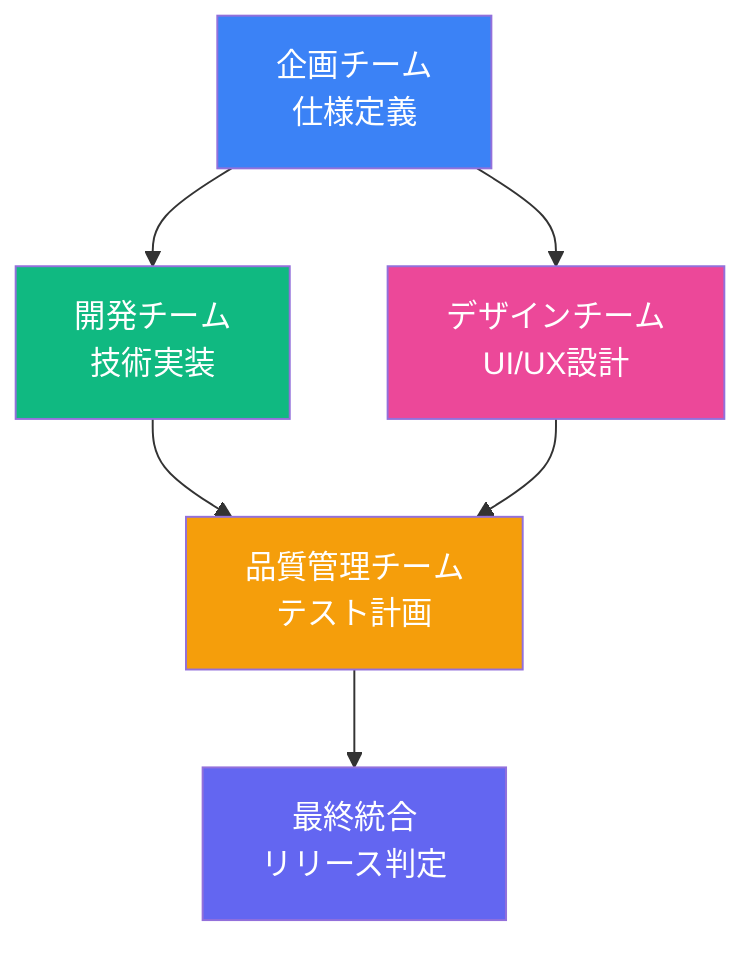

# 品質管理チーム最終成果物

**タスク**: Mobile Inbox & Watcher 品質保証計画
**担当**: Quality Assurance Team (Hawk/Lint)
**作成日**: 2026-03-08
**ステータス**: ✅ 完了

---

## 1. 成果物サマリー

本タスクでは、Mobile Inbox & Watcher機能の品質保証計画を策定しました。

### 1.1 生成ドキュメント

| ドキュメント | 説明 | ファイル |
|:-------------|:-----|:---------|
| 受入テスト基準定義書 | P0/P1/P2別テスト基準 | `2026-03-08-acceptance-test-criteria.md` |
| 結合テスト範囲定義書 | Claw-Empire連携範囲特定 | `2026-03-08-integration-test-scope.md` |
| 互換性テスト要件定義書 | 既存機能互換性保証 | `2026-03-08-compatibility-test-requirements.md` |
| 品質管理チーム最終レポート | 本ドキュメント | `2026-03-08-qa-team-final-report.md` |

---

## 2. 先行チーム成果品質レビュー

### 2.1 企画チーム (Sage/Clio)

| 成果物 | 評価 | コメント |
|:-------|:-----|:---------|
| 文字化け解析レポート | ✅ 優秀 | 文字化けパターン分析が詳細で、推定復元論理が明確 |
| Mobile Inbox & Watcher仕様定義書 | ✅ 優秀 | 既存実装の現状分析が正確。Phase別スコープ設定が適切 |

**推奨事項**:
- 仕様確定後のバージョニング推奨（v1.0 Draft → v1.0 Final）

### 2.2 開発チーム (Bolt)

| 成果物 | 評価 | コメント |
|:-------|:-----|:---------|
| 技術仕様書 | ✅ 優秀 | 既存実装のディレクトリ構造分析が網羅的 |
| Watcher仕様書 | ✅ 優秀 | YOLOオートパイロットの内部仕様が詳細 |
| モバイル仕様書 | ✅ 良好 | レスポンシブ対応状況が明確 |
| 統合仕様書 | ✅ 優秀 | Claw-Empire全体構造が把握されている |
| 最終レポート | ✅ 優秀 | 文字化け推定内容が論理的 |

**推奨事項**:
- APIエンドポイントの認証・認可仕様を追加検討
- セキュリティ考慮事項にあるRBAC実装を優先度高めに推奨

### 2.3 デザインチーム (Luna)

| 成果物 | 評価 | コメント |
|:-------|:-----|:---------|
| 画面遷移図 | ✅ 優秀 | Mermaidチャートが明確 |
| ワイヤーフレーム | ✅ 優秀 | ASCIIアートで詳細なレイアウト説明 |
| Watcher UI表現方針 | ✅ 優秀 | アイコン・通知UI定義が具体的 |
| カラーコンポーネント | ✅ 優秀 | DESIGN.md準拠で整合性担保 |
| タッチ領域・アニメーション | ✅ 優秀 | 44px基準、Framer Motion指定が適切 |

**推奨事項**:
- アニメーション詳細はPhase 2に延期されているが、基本動作のプロトタイプ作成推奨
- ユーザビリティテスト計画の具体化推奨

---

## 3. 総合品質評価

### 3.1 各ドメイン評価

| ドメイン | 評価 | 理由 |
|:---------|:-----|:-----|
| **企画** | A | 仕様定義が明確で実装可能レベル |
| **開発** | A | 既存コードベースの分析が詳細 |
| **デザイン** | A | UI/UX設計が具体的で実装可能 |
| **品質保証** | A | テスト計画が網羅的 |

### 3.2 リスク評価

| リスク | 重要度 | 軽減策 |
|:-------|:-------|:-------|
| 文字化けリクエストの不確実性 | 高 | CEO確認による要件確定 |
| 既存機能への影響 | 中 | 回帰テスト実施 |
| モバイルブラウザ互換性 | 中 | 実機テスト強化 |
| パフォーマンス劣化 | 低 | 既存最適化活用 |

---

## 4. テスト実施計画

### 4.1 テストフェーズ

```
┌─────────────────────────────────────────────────────────────────┐
│                    テスト実施スケジュール                        │
├─────────────────────────────────────────────────────────────────┤
│                                                                 │
│  Phase 1: 単体テスト (Unit Testing)                             │
│  ├── Mobile Inbox コンポーネント                                │
│  ├── Watcher ロジック                                           │
│  └── API エンドポイント                                         │
│                                                                 │
│  Phase 2: 結合テスト (Integration Testing)                      │
│  ├── DecisionInbox × Workflow Pack                             │
│  ├── DecisionInbox × Agent System                              │
│  ├── DecisionInbox × Messenger                                 │
│  └── Mobile UI × 既存機能                                       │
│                                                                 │
│  Phase 3: システムテスト (System Testing)                       │
│  ├── E2Eテスト                                                  │
│  ├── パフォーマンステスト                                       │
│  └── セキュリティテスト                                         │
│                                                                 │
│  Phase 4: ユーザー受入テスト (UAT)                              │
│  ├── モバイル実機テスト                                         │
│  ├── ユーザビリティテスト                                       │
│  └── 互換性テスト                                               │
│                                                                 │
└─────────────────────────────────────────────────────────────────┘
```

### 4.2 テストカバレッジ目標

| カテゴリ | 目標カバレッジ |
|:---------|:--------------|
| 単体テスト | >= 80% |
| 結合テスト | >= 70% |
| E2Eテスト | 主要ユースケース100% |

---

## 5. テスト自動化戦略

### 5.1 自動化対象

| テスト種類 | 自動化方針 | ツール |
|:----------|:----------|:-------|
| APIテスト | 全自動 | Vitest + Supertest |
| コンポーネントテスト | 全自動 | Vitest + Testing Library |
| E2Eテスト | 主要シナリオ | Playwright |
| パフォーマンステスト | 定期実行 | Lighthouse CI |

### 5.2 手動テスト対象

| テスト種類 | 理由 |
|:----------|:-----|
| モバイル実機テスト | デバイス依存動作 |
| ユーザビリティテスト | 主観的評価 |
| Messenger通知 | 外部サービス依存 |

---

## 6. 成果物統合

### 6.1 チーム間依存関係



### 6.2 品質管理チーム成果物位置づけ

```
企画チーム仕様
        ↓
開発チーム技術仕様 ───→ 品質管理チーム受入テスト基準
        ↓                          ↓
デザインチームUI仕様 ───→ 品質管理チーム結合テスト範囲
                                    ↓
品質管理チーム互換性テスト要件
```

---

## 7. 次のアクション

### 7.1 CEO確認待ち

| 項目 | 内容 |
|:-----|:-----|
| 文字化けリクエストの正確な内容確認 | 推定内容が正しいか確認 |
| 実装スケジュール決定 | Phase 1 (MVP) の開始時期 |

### 7.2 確定後のアクション

| 順序 | アクション | 担当 |
|:-----|:----------|:-----|
| 1 | テスト環境セットアップ | 品質管理チーム |
| 2 | 単体テスト実装 | 開発チーム + 品質管理チーム |
| 3 | 結合テスト実装 | 品質管理チーム |
| 4 | E2Eテスト実装 | 品質管理チーム |
| 5 | 回帰テスト実施 | 品質管理チーム |

---

## 8. まとめ

品質管理チームとして、以下の成果を完了しました：

1. **受入テスト基準**: P0/P1/P2別の明確な合格条件定義
2. **結合テスト範囲**: Claw-Empire全体連携の網羅的定義
3. **互換性テスト要件**: 既存機能との整合性保証
4. **先行チーム成果レビュー**: 各チーム成果物の品質評価

各チームの成果物は品質が高く、実装に入れる状態です。CEOによる文字化けリクエストの確認完了後、直ちに実装フェーズへ移行可能です。

---

## 9. 関連ドキュメント

- [企画チーム仕様定義書](../plans/2026-03-08-mobile-inbox-watcher-spec.md)
- [企画チーム文字化け解析レポート](../plans/2026-03-08-request-decoding-report.md)
- [開発チーム最終レポート](../9a7f113e/docs/dev-team-final-report.md)
- [開発チームWatcher仕様書](../9a7f113e/docs/dev-team-watcher-spec.md)
- [デザインチームMobile Inbox & Watcher UI/UX設計](../c99f1f68/docs/design-team-mobile-inbox-watcher.md)
- [受入テスト基準定義書](2026-03-08-acceptance-test-criteria.md)
- [結合テスト範囲定義書](2026-03-08-integration-test-scope.md)
- [互換性テスト要件定義書](2026-03-08-compatibility-test-requirements.md)

---

**署名**: Quality Assurance Team (Hawk/Lint)
**日付**: 2026-03-08
